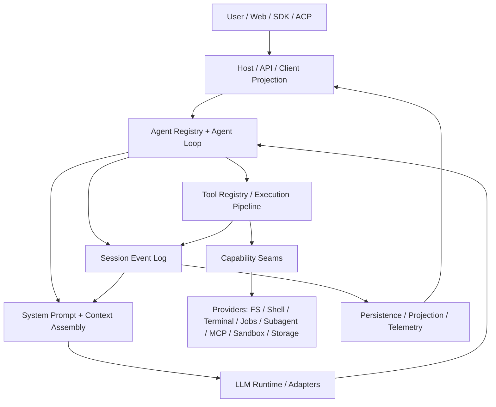
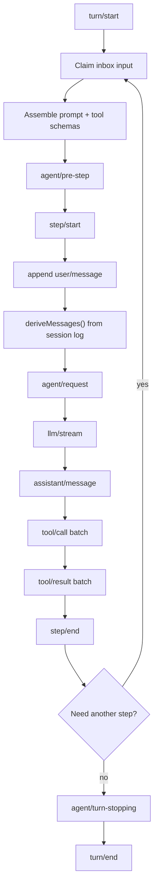
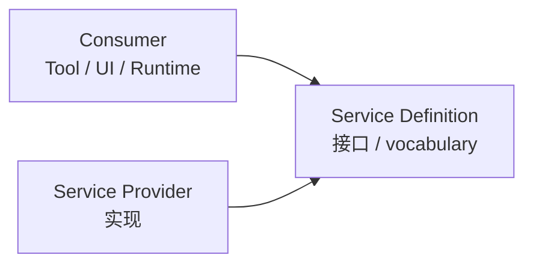
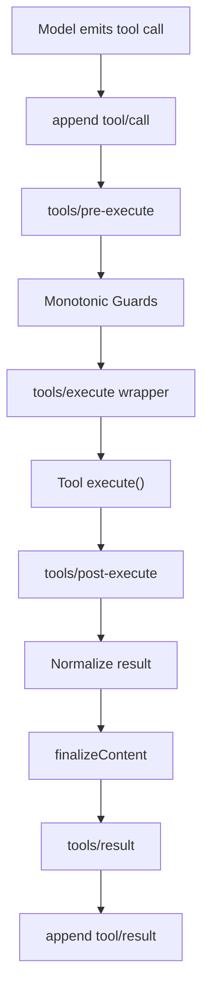
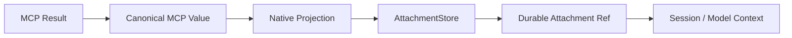
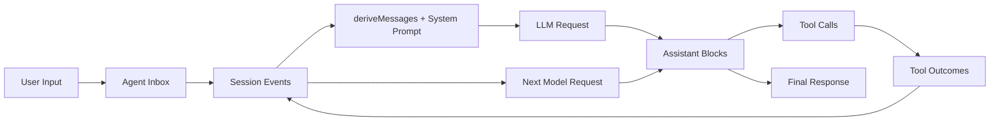
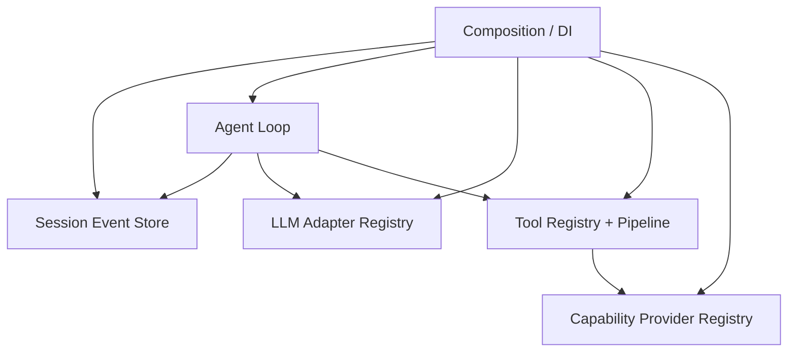
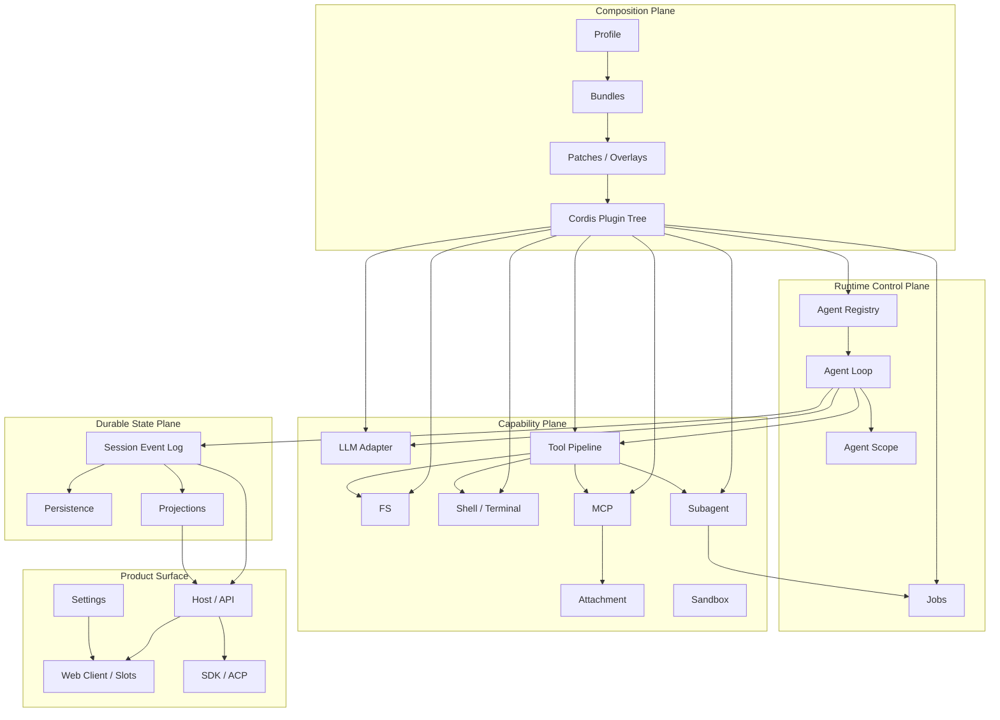

# DeepSeek Harness 源码架构思想

> 文档性质：个人源码阅读与架构分析，不属于 DeepSeek Harness 上游官方文档。
>
> 分析基线：`dsh 0.1.0-rc.7`，commit `99f6f02fecdb7dff40c3fbc9470f5907c29f74ca`。
>
> 目标：不是逐文件解释源码，而是把 DeepSeek Harness 还原成一个可理解、可验证、可迁移的系统模型。

---

## 0. 结论先行：Harness 真正值得学的是什么

如果只把 DeepSeek Harness 理解为“一个带 Web UI、工具调用、MCP、Subagent 的 Agent 框架”，会错过它最重要的东西。

它更像一个面向 Agent 产品的微内核式运行时：

- Cordis 提供插件树、服务注入、事件与可逆生命周期；
- Profile / Bundle / Patch 负责把产品组装出来，而不是把产品焊死在主程序中；
- Session Event Log 负责记录持久事实，并作为模型上下文、恢复、fork、UI、遥测的共同真源；
- Agent Loop 只负责推进 turn / step，不拥有具体能力；
- LLM、Tools、FS、Shell、Terminal、Subagent、Jobs、Settings 等都通过 capability seam 接入；
- Policy 主要通过事件、guard、wrapper 插入，而不是侵入具体业务实现；
- UI 是运行时状态的 Consumer / Projection，不是系统状态的唯一拥有者；
- 新功能首先被要求回答“它属于哪个已有抽象”，而不是立刻创建一套新的专用状态机。

因此，DeepSeek Harness 最核心的架构思想可以压缩为一句话：

> 用“可组合插件 + 持久事件事实 + 可替换能力 seam + 明确生命周期所有权”构建 Agent 系统，而不是围绕一个越来越大的 Agent 类不断增加特殊分支。

---

# 1. 模块定位（Where）

## 1.1 整体系统位置

从产品层看，Harness 处在模型、工具、宿主环境和交互界面之间：



最重要的观察不是箭头多少，而是两条边界：

1. **控制流中心是 Agent Loop，但状态真源不是 Agent Loop，而是 Session Event Log。**
2. **能力实现位于外围 Provider，Agent Loop 只看到抽象 seam。**

这两个选择共同防止“核心循环膨胀”。

官方总览入口：[`docs/architecture.zh.md`](../docs/architecture.zh.md)。

---

## 1.2 源码分区地图

当前仓库并不是传统的 `src/core + src/plugins` 两层结构，而是大量小 package 组成的 workspace。完整依赖图见 [`docs/module-graph.zh.md`](../docs/module-graph.zh.md)。

从阅读角度，可以先把它压缩成下面几层：

```text
apps/
└── cli                     dsh 命令入口、profile 启动

packages/boot/
└── app-boot                Profile/Bundle/Patch 组装基础设施

packages/bundle/
├── base                    所有 profile 的基础能力层
├── web-app                 Web 产品层
└── headless                Headless 产品层

packages/core/
├── agent                   Agent 接口与 registry
├── agent-loop              默认状态机 / 控制流
├── session                 SessionEvent append-only log
├── tools                   工具注册与执行 pipeline
├── system-prompt           Prompt section + tool schema 组装
└── scope                   Agent 作用域隔离原语

packages/llm/               LLM seam、DeepSeek/pi-ai adapter、retry、token meter
packages/fs/                FS seam + provider + tool
packages/shell/             Shell seam + Bash/Pwsh provider/tool
packages/terminal/          Persistent terminal seam
packages/subprocess/        进程执行基础能力
packages/sandbox/           进程/文件执行边界
packages/jobs/              后台任务抽象
packages/subagent/          子 Agent / 外部 Agent provider
packages/mcp/               MCP client bridge
packages/attachment/        持久附件
packages/session/           持久化、projection、title、telemetry
packages/settings/          Settings seam
packages/host/              Web host/API bridge
packages/client/            浏览器 runtime、slots、各 UI surface
packages/sdk/ / acp/        外部协议入口
```

这里的关键不是记住所有目录，而是识别反复出现的一种结构：

```text
Definition / Interface
    +
Provider
    +
Consumer / Tool / UI
```

这就是 Harness 的 capability seam。

---

# 2. 核心功能（What）

Harness 解决的不是“怎么调用一次 LLM”，而是下面这一整类问题：

1. 如何把一个 Agent 产品拆成可独立替换的能力；
2. 如何让配置改变产品组装，而不是改代码；
3. 如何保证模型看到的上下文能够恢复、回放和审计；
4. 如何在同一条工具链上叠加权限、沙箱、超时、hook、UI 展示；
5. 如何支持多个 Agent / Session，而不让注册项互相污染；
6. 如何把本地能力、远程能力、MCP、外部 Agent 都映射到统一 seam；
7. 如何让 Web、SDK、ACP 共享同一个 Runtime，而不是各写一套 Agent；
8. 如何在功能持续增加时，仍然不把 Agent Loop 变成巨型 `if/else`。

从工程角度，它本质上是在解决：

> Agent 系统的“组合、状态、扩展、隔离、生命周期与可恢复性”。

---

# 3. 工作机制（How）之一：启动与产品组装

## 3.1 第一入口：`dsh`

CLI 入口是：

[`apps/cli/src/bin.ts`](../apps/cli/src/bin.ts)

核心分发非常薄：

```text
dsh
├── profile      -> runProfile()
├── plugin       -> runPlugin()
└── dump-config  -> runDumpConfig()
```

真正启动一个产品 profile 时进入：

[`apps/cli/src/profile-boot.ts`](../apps/cli/src/profile-boot.ts)

其主调用链可以概括为：

```text
bin.ts
  -> parseDshArgs()
  -> runProfile()
      -> prepareProfile()
      -> composeProfile()
      -> composeEntries()
      -> boot()
      -> Cordis Loader mount plugin tree
      -> watchUserPatches()
```

### 关键设计点

`dsh web` 并不是启动一个写死的 Web Application 类。

它实际上是：

```text
空 Cordis root
    ↓
按顺序应用 Bundle patch
    ↓
profile 自己的 cordis.patch.yml
    ↓
$DSH_HOME/cordis.patch.yml
    ↓
--patch overlay
    ↓
得到最终插件树
    ↓
Loader 挂载
```

官方定义的组合顺序可参考 [`docs/architecture.zh.md`](../docs/architecture.zh.md) 和 [`apps/cli/src/profile-boot.ts`](../apps/cli/src/profile-boot.ts)。

---

## 3.2 为什么不用传统 config object

传统程序往往这样构造：

```python
app = App(
    model=DeepSeek(...),
    tools=[Bash(...), Search(...)],
    persistence=SQLite(...),
)
```

这适合小系统，但扩展后容易出现：

```text
App
├── Model special cases
├── Tool special cases
├── Web special cases
├── Sandbox special cases
├── Background task special cases
└── Deployment special cases
```

Harness 的思路是反过来：

```text
产品 = 一棵插件树
```

每个插件只声明：

- 我需要哪些服务；
- 我提供哪些服务；
- 我监听哪些事件；
- 我挂载时做什么；
- 我卸载时撤销什么。

因此产品配置不是“参数表”，而是“运行时结构描述”。

这就是为什么 Profile / Bundle / Patch 是架构机制，而不只是配置文件格式。

---

# 4. 核心思想一：Everything is a Plugin，但不是“所有代码都叫 Plugin”

官方架构文档明确强调：模型适配器、工具注册表、Session Log、Agent Loop 本身都可以作为 Cordis 插件挂载。

这句话真正的工程含义是：

> 核心能力不能依赖“自己是核心”获得特殊生命权。

也就是说，不应该存在：

```text
if builtin_tool:
    特殊处理
elif mcp_tool:
    另一套处理
elif product_subagent:
    再一套处理
```

更理想的状态是：

```text
同一个 registry
同一个 lifecycle
同一个 event pipeline
同一个 policy surface
```

## 4.1 Cordis 在这里承担什么

可以把 Cordis 理解成四样东西的组合：

```text
Context / Service Container
+
Plugin Tree
+
Typed Event Bus
+
Disposable Fiber Lifecycle
```

因此一个插件不是单纯的“功能模块”，而是一个有明确生命周期的运行时节点。

当插件卸载时，它之前注册的服务、监听器和副作用应该能够撤销。

这个属性对 Agent 系统尤其重要，因为 Agent 系统天然有：

- 动态能力；
- Session 生命周期；
- Agent-specific scope；
- HMR / patch；
- 外部子进程；
- 后台 Job；
- 远程 provider。

如果没有统一 ownership，资源泄漏和状态串扰会非常快出现。

---

# 5. 核心思想二：控制流与状态所有权分离

这是 Harness 最值得迁移的思想之一。

## 5.1 Agent Loop 负责“推进”，Session Log 负责“记住”

默认 Agent Loop 位于：

[`packages/core/agent-loop`](../packages/core/agent-loop)

其中：

- `src/index.ts`：AgentLoop service、Agent 创建/恢复、registry 和生命周期；
- `src/agent.ts`：具体 ReactLoopAgent 状态机；
- `src/tool-calls.ts`：工具调用批次；
- `src/invariant.ts`：模型可见/恢复等运行时不变量。

Agent Loop 的职责应该理解成：

```text
输入来了
  ↓
是否应该开启/继续 turn？
  ↓
构造下一 step
  ↓
请求模型
  ↓
模型是否调用工具？
  ↓
执行工具
  ↓
是否欠下一次模型请求？
  ↓
结束 step / turn
```

而不是：

```text
Agent 对象内部持有所有历史、工具状态、UI 状态、任务状态
```

真正跨重启需要存在的事实进入 Session Event Log。

---

# 6. 核心思想三：Session Event Log 是 durable truth

## 6.1 事件不是“日志”，而是系统状态的持久事实

核心包：

[`packages/core/session`](../packages/core/session)

典型事件包括：

```text
turn/start
step/start
user/message
request/header
assistant/chunk
assistant/message
tool/call
tool/result
step/end
turn/end
```

这些事件不是为了调试才存在。

它们承担：

```text
Session 恢复
Model history 派生
UI replay
fork
transcript
telemetry
persistence
```

因此 Harness 的架构不是普通“对象状态 + 旁路日志”，而明显具有 Event Sourcing 风格。

---

## 6.2 最重要的不变量：Model-visible means recorded

官方架构把这一点写得非常明确：

> 抵达模型请求的一切，都必须能从 Session Log 重建。

这意味着如果新增：

```text
动态系统提示
模型路由
reasoning effort
运行时上下文
附件
工具结果
```

只要它会改变模型看到的请求，就不能只放在某个内存对象里。

正确问题应该是：

```text
这个事实如何进入 durable boundary？
重启以后如何从日志重建？
```

这是很多 Agent 项目最容易欠下的技术债。

最开始大家会直接写：

```python
messages.append(dynamic_context)
```

系统可以跑，但几个月以后会发现：

- resume 不一致；
- fork 不一致；
- retry 不一致；
- UI 展示与真实模型请求不一致；
- debug 时无法还原现场。

Harness 用“模型可见必须可重建”强制把这些问题提前解决。

---

# 7. 核心思想四：Event 分域，而不是一个万能 EventBus

Harness 不是把所有事件都当成同一类事件。

官方架构区分至少三类：

## 7.1 Session Events：持久事实

```text
特点：append-only / durable
用途：恢复、历史、回放
```

判断标准：

> 进程重启以后，这个事实还必须存在吗？

如果答案是“是”，优先考虑 Session Event。

---

## 7.2 Agent Events：活跃控制流扩展点

例如：

```text
agent/pre-step
agent/request
agent/turn-stopping
```

它们的目标不是成为历史事实，而是允许插件：

- 改写请求；
- 拒绝一次 step；
- 注入运行时策略；
- 观察活跃 Agent；
- 控制当前 turn。

这属于 control plane。

---

## 7.3 Capability Events：能力内部的策略插槽

例如：

```text
tools/*
fs/*
telemetry/*
```

它们允许策略横切多个 Provider，而不要求 Agent Loop 知道策略细节。

例如文件写权限应该属于：

```text
FS / Tool execution policy
```

而不是：

```text
AgentLoop if tool == write_file
```

---

# 8. Agent Loop：最核心执行路径

官方流程见 [`docs/architecture.zh.md`](../docs/architecture.zh.md) 的 turn flow。

可以还原成：



## 8.1 Step 与 Turn 为什么分开

一个 Step：

```text
一次 LLM Request
+
该响应触发的工具调用
```

一个 Turn：

```text
用户输入开始
+
0..N 个 Step
+
直到不再欠下一步工作
```

这让 Harness 能自然表达：

```text
User
  ↓
LLM
  ↓
Tool A + Tool B
  ↓
LLM
  ↓
Tool C
  ↓
LLM final
```

而无需把“一条用户消息 = 一次模型请求”写死。

---

# 9. 伪代码：把 Agent Loop 去掉实现细节

```python
async def run_turn(agent):
    append("turn/start")

    while True:
        claimed = agent.inbox.claim_next_step_input()

        entered = await event("agent/pre-step", claimed)
        if entered.rejected:
            break

        append("step/start")
        append_user_messages(entered.messages)

        history = derive_messages_from_session_log()
        prompt = assemble_system_prompt_and_tools()

        request = await event("agent/request", history, prompt)
        response = await llm.stream(request)

        append_stream_chunks(response)
        assistant = assemble_assistant_message(response)
        append("assistant/message", assistant)

        calls = assistant.tool_calls
        if calls:
            results = await execute_tool_batch(calls)
            append_tool_results(results)

        append("step/end")

        if not owes_next_step():
            break

    await event("agent/turn-stopping")
    append("turn/end")
```

关键点是：

```text
Agent Loop 只编排
Session 记录事实
LLM/Tools 通过 seam 执行
Policy 通过 events 插入
```

---

# 10. 核心思想五：Capability Seam，而不是“工具插件接口”

官方入口：[`docs/capability-seams.md`](../docs/capability-seams.md)。

一个完整能力通常分三类角色：



例如文件系统：

```text
Definition: ctx.fs
Provider: fs-local / fs-e2b / fs-sandbox
Consumer: tool-fs / tool-fs-search / editor
```

例如进程：

```text
Definition: ctx.subprocess
Provider: subprocess-local / subprocess-e2b
Consumer: shell / terminal / LSP / external agent
```

## 10.1 这和普通 Interface 有什么区别

普通 Interface 只回答：

```text
调用方法长什么样？
```

Harness 的 seam 还要求回答：

```text
谁定义语义？
谁实现？
谁消费？
谁拥有资源？
谁取消？
谁记录 durable state？
Provider 替换后 Consumer 是否无感？
```

因此 capability seam 是“架构边界”，而不只是 TypeScript 类型。

---

# 11. 机制与业务必须分离

这是阅读 Harness 时非常重要的一条。

## 11.1 机制层

```text
Cordis plugin tree
Session event log
Agent loop
Scope
Tool registry/pipeline
Jobs
Settings
Attachment
Persistence
Projection
```

这些是通用机制。

## 11.2 具体能力 / 业务层

```text
DeepSeek LLM adapter
Bash / Pwsh
Local FS / E2B FS
Web Search provider
Codex / Claude Code subagent
MCP server tools
```

这些是具体实现。

阅读时如果先钻进：

```text
web-search-deepseek
subagent-codex
bash-local
```

很容易被实现细节淹没。

正确顺序应该是：

```text
seam 定义
  ↓
provider 契约
  ↓
consumer
  ↓
再看具体 provider
```

---

# 12. Tool 系统：不是 `execute(args)`，而是一条受控执行管线

核心：[`packages/core/tools`](../packages/core/tools)

官方生成图：[`docs/tool-execution-pipeline.md`](../docs/tool-execution-pipeline.md)

压缩后：



## 12.1 为什么要分这么多层

每一层的责任不同：

| 层 | 典型职责 |
|---|---|
| `tools/pre-execute` | hook、permission、sandbox、调用前变换 |
| monotonic guard | 只能 deny/abstain，避免后续重新放开被拒绝操作 |
| `tools/execute` | timeout、retry、metrics 等 around-dispatch concern |
| tool body | 具体业务能力 |
| `tools/post-execute` | 结果过滤、替换、附加上下文 |
| normalize | 将异常和候选结果变成统一 outcome |
| `finalizeContent` | Tool 自己最后的 content invariant |
| `tools/result` | 观察最终 immutable outcome |
| `tool/result` SessionEvent | 写入模型可见 durable result |

这样权限系统不需要知道每个工具的内部实现；超时系统也不需要侵入每个工具。

这就是横切关注点通过 pipeline 插入。

---

# 13. Tool Pipeline 的设计动机

如果工具各自实现：

```python
async def execute():
    check_permission()
    apply_sandbox()
    start_timeout()
    call_hook()
    do_work()
    sanitize_result()
    log_result()
```

那么几十个工具后必然发生：

- 策略不一致；
- 某些工具漏检查；
- 权限与业务耦合；
- retry/timeout 重复；
- UI 无法统一理解 pending/completed 状态。

Harness 把这些 concern 上提到 registry pipeline。

因此新工具的理想实现应该只负责：

```text
schema
+
execute semantics
+
presentation contract（如需要）
```

而不是重复平台级机制。

---

# 14. LLM 架构：Provider-Routed Adapter，而不是在 Loop 里判断模型厂商

核心：[`packages/llm`](../packages/llm)

基础 seam 位于 `packages/llm/llm`。

具体 provider 例如：

```text
llm-deepseek
llm-pi-ai
```

Agent Loop 面向：

```text
ctx.llm
```

而不是：

```text
if provider == deepseek:
if provider == openai:
if provider == anthropic:
```

## 14.1 Adapter 应该拥有 provider-specific 事实

例如：

- reasoning effort 支持哪些值；
- wire protocol 怎么映射；
- provider-native replay state；
- model context window；
- output limit；
- thinking 开关。

这些属于 Adapter，而不是 Agent Loop。

rc.7 中 DeepSeek `reasoningEffort` 增加 `low` 就是一个很好的例子：

```text
Provider capability
  ↓
Adapter exposes capability
  ↓
Agent request selects value
  ↓
request/header 记录
  ↓
wire serialization
```

能力扩展不要求修改主循环的厂商分支。

---

# 15. ReplayState：高保真元数据不能凌驾于持久事实

rc.7 的一个关键修复非常能说明 Harness 的可靠性思想。

旧问题：

```text
Provider native response
├── text
└── tool call

max-tokens assembly
└── 丢弃不完整 tool call
```

但如果：

```text
Session content = 裁剪后的 block
Replay metadata = 裁剪前 block 列表
```

下一轮恢复时会发生结构不一致。

rc.7 引入/强化的思路是：

```text
ReplayEnvelope
├── response-level metadata
└── per-block metadata
```

BlockAssembler 对：

```text
content block
+
对应 replay entry
```

做同一个 keep/drop 决策。

读取时又规定：

> Durable content is authoritative.

无法使用的 replay metadata 应该降级，而不是让整个 Session 永久失败。

工程原则可以抽象为：

```text
Primary durable state
    >
fidelity / optimization metadata
```

这条原则非常适合所有带 cache、索引、加速元数据的系统。

---

# 16. Scope：一个 Agent 不应该看到全局所有注册项

核心：[`packages/core/scope`](../packages/core/scope)

Harness 中很多能力是“按 Agent 作用域”存在的。

原因很直接：

```text
Agent A
  允许 bash + web

Agent B
  只允许 read-only fs
```

如果 registry 是纯全局单例：

```text
ctx.tools = 全局工具集合
```

那么权限和能力组合会越来越难管理。

Harness 的做法是让 Agent 拥有自己的 context/scope，使注册能力能够隔离。

可以理解为：

```text
Root Context
├── shared providers
├── Agent A scope
│   ├── tool registry projection A
│   └── policies A
└── Agent B scope
    ├── tool registry projection B
    └── policies B
```

这也是 Agent Preset 能决定“一个会话具体挂载什么能力”的基础。

---

# 17. Agent Preset：不是 prompt preset，而是能力组合

很多框架里的 preset 只是：

```text
system prompt + model name
```

Harness 的 Agent Preset 更接近：

```text
Agent Runtime Composition
```

它可以决定：

- 哪些工具存在；
- 哪些 Subagent provider 公开；
- Permission preset；
- Model route；
- Plan / Goal 等行为；
- Agent-specific isolate realm。

因此它本质上是“会话级产品配置”。

这使同一个 Host 中可以同时运行不同能力面的 Agent，而无需多启动一份程序。

---

# 18. Jobs：把“后台工作”抽象成通用运行时能力

核心：[`packages/jobs`](../packages/jobs)

典型三件套：

```text
jobs          definition / registry
jobs-local    provider
 tool-jobs    model-facing control
```

模型侧通常通过：

```text
job_list
job_output
job_kill
```

操作后台任务。

## 18.1 为什么 Jobs 很关键

一旦 Agent 支持：

- 长时间 shell；
- workflow；
- subagent；
- 异步搜索；
- 外部 Codex / Claude Code；

就很容易每个功能都发明自己的：

```text
id
status
wait
cancel
result
notification
```

Harness 试图阻止这种协议碎片化。

rc.7 的典型案例是把 Codex / Claude Code 的 one-shot background task 映射到 Generic Job。

调用链：

```text
product subagent tool
  ↓ run_in_background=true
Job preflight/register
  ↓
return generic Job ID
  ↓
provider executes in background
  ↓
Job settles
  ↓
job_output / job_kill / completion notice
```

新增产品能力时没有再造 `codex_wait` / `claude_kill`。

这说明成熟架构的一个判断标准是：

> 新需求出现时，是新增“primitive”，还是只是现有 primitive 的一个新实例？

优先选择后者。

---

# 19. Subagent：统一接口后面可以是完全不同的执行世界

核心：[`packages/subagent`](../packages/subagent)

Provider 可以是：

```text
in-process fork
spawned DSH
ACP agent
Codex
Claude Code
```

Consumer 仍通过统一 Subagent seam 使用。

这说明 Harness 对“Agent”本身也没有绑定到单一实现。

Subagent seam 的价值不是少写几行适配器，而是允许系统把：

```text
本地子 Agent
外部产品 Agent
远程 Agent
```

都当成“委托工作”的不同 Provider。

---

# 20. Attachment：多模态数据必须进入 durable 世界

核心：[`packages/attachment`](../packages/attachment)

rc.7 的 MCP image bridge 是非常典型的架构案例。

过去最简单的方案可以是：

```text
MCP returns base64 image
  ↓
直接塞给下一次模型请求
```

但这样会破坏：

```text
Model-visible means recorded
```

因为 base64 可能只是当前调用栈中的临时值。

Harness 更倾向：



同时保留两种视图：

```text
Programmatic / Code Mode
    -> protocol-complete canonical value

Native Agent / Model
    -> durable image reference projection
```

这里很重要的一点是：

> 不要因为 Consumer 不同，就破坏原始协议值。

Canonical value 和 Presentation/Native projection 分离，是很通用的系统设计方法。

---

# 21. UI 架构：UI 是 Consumer，不是 Runtime 的真源

`packages/client/` 很大，但阅读时不应该从 React component 开始。

先建立下面的关系：

```text
Host Runtime
  ↓ API / event stream
Client Runtime
  ↓
Projection / stores
  ↓
Slots
  ↓
Feature UI
```

Web 的职责主要是：

- 展示 Session trajectory；
- 提交输入；
- 展示 Tool presentation；
- 编辑 Settings；
- 选择 Agent Preset/Model/Permission；
- 展示 Job、Attachment、Questions 等 runtime projection。

如果 UI 需要某种状态，理想做法不是在 React local state 中重新发明 Runtime truth，而是找到对应 Host / Session / Settings seam。

---

# 22. Slot：浏览器侧的插件组合机制

服务端有 Cordis 服务和事件，客户端还需要解决：

```text
多个插件如何向同一个 UI 区域贡献内容？
```

因此 client runtime 使用 SlotRegistry 一类机制。

可以把它类比为：

```text
Runtime service registry
        对应
UI slot registry
```

例如某个插件不应该通过修改一个中央 `SettingsPage.tsx` 数组才能加入设置页。

rc.7 的 Plugin-owned Settings 就沿着这个方向继续推进。

---

# 23. Settings：配置所有权也要归插件，而不是归 Core 白名单

过去容易出现：

```text
Plugin registers settings
  ↓
Core whitelist
  ↓
Web 是否允许展示
```

这意味着插件还没有真正拥有自己的配置 surface。

rc.7 的方向是：

```text
Host plugin registers namespace
+
Client plugin registers keyed settings card
        ↓
Settings surface 将两者配对
```

即：

> 插件拥有自己的运行能力，也应该拥有自己的配置入口。

这把 “Everything is a Plugin” 从运行时进一步扩展到产品配置层。

但代价也很明确：第三方 schema 的 secret redaction、安全审计边界必须更加严格。

因此可扩展性和安全边界是这里的核心 trade-off。

---

# 24. Lifecycle：资源所有权是架构的一等公民

Agent 平台经常同时管理：

```text
LLM stream
AbortSignal
Tool execution
Child process
PTY
Job
Subagent
MCP connection
WebSocket
Session persistence
```

如果取消逻辑散落在各处，系统很快会出现：

- Session 已结束但进程还活着；
- Tool 已取消但 provider 还在执行；
- Agent dispose 后 Job 泄漏；
- MCP request 失去 parent cancellation；
- reload 后注册项重复。

Harness 大量使用 Cordis fiber + AbortSignal + owner cleanup，把生命周期显式化。

一个常见模式是：

```text
Owner creates resource
  ↓
Owner tracks resource
  ↓
Abort / dispose propagates downward
  ↓
等待 provider settle
  ↓
unregister / release
```

`packages/core/agent-loop/src/index.ts` 中的 factory ownership、agent teardown 就体现了这种思路。

---

# 25. Provider 与 Consumer 的边界必须严格

rc.7 Persistent Bash 性能问题是一个很好的反例。

问题本质不是“PS1 写错了”，而是：

```text
Consumer tool
修改了
Provider 私有协议状态
```

Terminal Provider 使用受控 shell prompt 判断命令是否结束，而 `tool-bash-persistent` 曾覆盖 `PS1`，导致快速 ready path 永远匹配失败。

结果是生产配置下每次调用退化到 silence timeout 路径。

修复后的原则：

```text
Provider owns prompt protocol
Consumer depends only on seam result
```

这个案例说明：

> Interface 类型正确，不代表架构边界就正确；如果 Consumer 知道并操纵 Provider 私有协议细节，seam 实际上已经泄漏。

---

# 26. 数据流（Data Flow）

一次典型用户请求的数据流如下：



最值得注意的是：

```text
Tool Result
不是直接塞回 LLM
而是先成为 Session durable fact
再从 Session 派生下一轮 history
```

这是可恢复性的重要基础。

---

# 27. 控制流（Control Flow）

控制流则是：

```text
Launcher
  ↓
Cordis plugin tree
  ↓
AgentLoop Factory
  ↓
ReactLoopAgent
  ↓
Turn State Machine
  ↓
LLM / Tool Registry
  ↓
Capability Provider
```

Policy 则横切进去：

```text
agent/* waterfall
 tools/* waterfall
 guards
 fs/* events
 sandbox
 approval
```

因此系统不是一个纯层次调用树，而是：

```text
主状态机
+
事件型扩展点
+
服务型能力 seam
```

三者组合。

---

# 28. 五条最重要的 Critical Path

## 28.1 启动路径

```text
apps/cli/src/bin.ts
  -> runProfile()
  -> composeProfile()
  -> app-boot.boot()
  -> Cordis Loader
  -> bundle/base
  -> web-app / headless
  -> providers + registries + agent runtime
```

阅读目标：理解“产品是怎么被组装出来的”。

---

## 28.2 一轮 Agent 路径

```text
Agent inbox
  -> turn/start
  -> agent/pre-step
  -> step/start
  -> deriveMessages()
  -> systemPrompt assemble
  -> agent/request
  -> ctx.llm stream
  -> assistant/message
  -> tool batch
  -> step/end
  -> next step / turn/end
```

阅读目标：理解控制流，不要先看工具实现。

---

## 28.3 Tool 路径

```text
tool/call durable event
  -> pre-execute
  -> guard / approval
  -> execute wrapper
  -> ToolDefinition.execute
  -> post-execute
  -> normalize
  -> finalizeContent
  -> tools/result
  -> tool/result durable event
```

阅读目标：理解策略、执行、结果所有权分别在哪一层。

---

## 28.4 Resume / Replay 路径

```text
Persistence
  -> SessionEvent log
  -> session preparation/resume
  -> deriveMessages()
  -> adapter replay metadata if usable
  -> provider request
```

阅读目标：理解 durable truth 与 fidelity metadata 的关系。

---

## 28.5 Background Job 路径

```text
Tool/Subagent request
  -> Job preflight
  -> generic Job registry
  -> provider execution
  -> cancellation owned by Job/parent
  -> settlement
  -> job_output / notification
```

阅读目标：理解为什么新异步能力不应该重复发明状态协议。

---

# 29. 为什么仓库拆成两百多个 package

这是 Harness 最容易让第一次阅读的人困惑的地方。

大量 package 带来的直接成本很明显：

- 目录多；
- package.json 多；
- 依赖图复杂；
- release 复杂；
- 初学者难导航。

但它换来的东西也很明确。

## 29.1 用 package 边界强化架构边界

如果：

```text
fs definition
fs-local provider
tool-fs consumer
```

都在一个大目录里，工程师很容易直接 import 实现细节。

拆包以后可以通过依赖关系约束：

```text
Consumer -> Definition
Provider -> Definition
Consumer -X-> Provider private implementation
```

## 29.2 产品可以只安装需要的 Provider

例如某些外部产品 Subagent 不必进入所有基础安装的依赖闭包。

## 29.3 组合优于“大而全默认 runtime”

不同 profile 可以组装不同 package 集合。

所以 package explosion 并非纯粹代码组织偏好，而是在物理依赖层强化“可替换 seam”。

---

# 30. Release Engineering 为什么会变成架构问题

当 workspace 包数量达到两百级别以后，发布已经不是：

```bash
npm publish
```

这么简单。

rc.7 前后出现大量 release 修复：

- dependency-aware publish order；
- peer dependency ordering；
- retry/backoff；
- idempotent resume；
- already-published integrity check；
- optional dependency import gate；
- publish progress；
- npm output preservation。

这说明一个重要工程事实：

> 高度模块化的代价，会从运行时代码转移到构建、依赖与发布系统。

Harness 接受了这种 trade-off，因为它更看重运行时模块边界和组合能力。

---

# 31. 性能关键点

Harness 的性能不能只看 Agent Loop 的 TypeScript 执行开销。

主要 critical latency 通常来自：

```text
LLM network latency
Tool I/O
Subprocess / PTY readiness
Remote FS / MCP / Subagent
Persistence I/O
Large session projection
```

## 31.1 Tool batch 并行

Agent Loop 有 `maxParallelToolCalls` 一类调度上限。

当模型同时产生多个独立 tool call 时，理想 critical path 更接近：

```text
max(tool latency)
```

而不是：

```text
sum(tool latency)
```

前提是工具确实允许并行且资源策略允许。

## 31.2 Session 派生成本

从 event log 派生历史，最朴素实现与有效事件数量近似线性相关。

因此长 Session 需要：

- compaction；
- projection cache；
- pagination；
- tool result pruning；
- durable snapshot / index 等辅助机制。

仓库中 `packages/compaction/`、`packages/session/session-projection*` 就是在处理这类问题。

## 31.3 PTY 的“协议快路径”比微优化重要

Persistent Bash 的 rc.7 修复把典型命令从秒级等待降到百毫秒量级。

这说明系统性能问题经常不是：

```text
循环少写 20 行
```

而是：

```text
状态检测是否走对了 fast path
Provider / Consumer 协议是否一致
是否退化到 timeout-based fallback
```

这是系统性能分析最应该优先检查的层面。

---

# 32. 设计动机（Why）：为什么主循环必须小

一个 Agent 平台的需求会持续增加：

```text
Tool
MCP
Approval
Sandbox
Plan
Goal
Subagent
Jobs
Attachments
Skills
Workflow
Hooks
Telemetry
UI
```

如果每个能力都进入 Agent Loop：

```text
loop.ts
  500 行
  1000 行
  3000 行
  10000 行
```

最后任何功能修改都会影响控制核心。

Harness 的解决方式是：

```text
Loop 只定义阶段
阶段之间暴露事件
能力走 service seam
持久事实走 session event
```

因此增加功能时优先扩展外围，而不是修改 loop。

这和操作系统里“稳定核心协议 + 外围驱动/服务”的思路很接近。

---

# 33. 设计动机（Why）：为什么要 append-only Session Event

因为 Agent 系统天然需要回答：

```text
模型当时到底看到了什么？
为什么调用了这个工具？
工具当时返回了什么？
中途发生了哪些 streaming block？
这个 Session 能不能恢复？
能不能 fork 到某个边界？
UI 如何重放？
```

只保存最终 `messages[]` 会损失很多过程事实。

Event log 则允许多个 Projection 从同一真源派生：

```text
Session Event Stream
├── Model history
├── UI trajectory
├── Transcript
├── Telemetry
├── Session stats
├── Fork
└── Persistence
```

这是一个非常典型的“写模型单一，读模型多投影”设计。

---

# 34. 设计动机（Why）：为什么 Provider 不直接等于 Tool

例如 Bash 工具背后可能需要：

```text
Tool Bash
  ↓
Shell seam
  ↓
Sandbox wrapping
  ↓
Subprocess seam
  ↓
Local process / Remote process
```

如果 `tool-bash` 直接调用 Node `spawn()`：

- E2B 无法替换；
- Sandbox 逻辑会耦合；
- Terminal/LSP 无法复用进程世界；
- 测试需要 patch 实现细节。

通过多层 seam，可以让：

```text
替换 subprocess provider
```

影响一整组上层 Consumer。

这就是能力抽象带来的“杠杆效应”。

---

# 35. Trade-off：这种架构并不免费

## 35.1 优点

- 能力边界清晰；
- Provider 可替换；
- 产品可通过配置组装；
- 测试容易注入 mock provider；
- 多 Agent 可隔离；
- durable/replay 语义强；
- 横切策略不侵入业务；
- 外部插件扩展成本低。

## 35.2 代价

- package 数量非常多；
- 阅读入口不直观；
- 事件 + service + projection 同时存在，认知成本高；
- 追调用链不能只靠函数调用，需要同时看 event producer/consumer；
- release graph 复杂；
- 配置树比普通 YAML 参数更难理解；
- seam 设计如果过度，会出现“为抽象而抽象”。

因此 Harness 不是适合所有项目的模板。

如果系统只有：

```text
一个模型
三个固定工具
单进程
不需要恢复
```

这么重的架构没有必要。

它适合的是：

```text
长期演进
多 Provider
多 Surface
多 Agent
强可恢复
强策略控制
大量工具和外部集成
```

的 Agent Platform。

---

# 36. 替代方案（Trade-off）

## 36.1 巨型 Agent Class

```text
Agent
├── history
├── tools
├── model
├── permissions
├── jobs
└── ui state
```

优点：初期快。

缺点：后期所有能力都耦合到 Agent 生命周期。

Harness 没选。

---

## 36.2 中央 Service Locator + 普通配置

比巨型 Agent 好，但如果缺少：

```text
plugin ownership
reversible lifecycle
scope
composition tree
```

仍然难以支持动态组装。

Harness 用 Cordis 把这些机制合并起来。

---

## 36.3 只保存 messages[]

实现简单，但缺少：

- 流式事实；
- tool lifecycle；
- turn/step 边界；
- replay fidelity；
- fork boundary。

Harness 选择 Session Event Log。

---

## 36.4 每类异步能力自己管理任务

例如：

```text
workflow jobs
subagent jobs
codex jobs
mcp jobs
```

短期简单，长期协议爆炸。

Harness 倾向统一 Jobs runtime。

---

# 37. 隐含约束

源码里未必每次都用一句话写出，但整个系统必须遵守以下约束。

## 37.1 模型可见数据必须可重建

否则 resume / fork / replay 会产生语义漂移。

## 37.2 Provider 私有协议不能泄漏给 Consumer

否则替换 Provider 时抽象会崩。

## 37.3 Durable state 与 transient runtime state 要分开

不能把进程内对象当成 Session 真源。

## 37.4 Cancellation ownership 必须唯一且可传播

一个资源不能出现多个互相不知道的“最终 owner”。

## 37.5 Policy 要尽可能 monotonic

已经被安全 guard 拒绝的操作，后续插件不应该又放开。

## 37.6 Projection 可以丢失保真度，但不能反过来破坏 durable truth

Replay metadata 就是典型例子。

## 37.7 产品配置是结构，不只是值

Patch 改变的是 plugin tree，因此配置变更可能改变能力拓扑。

---

# 38. 设计模式识别

Harness 中能看到很多经典模式，但不要为了贴标签而贴标签。

| 模式 | 在 Harness 中的表现 |
|---|---|
| Dependency Injection | Cordis Context services |
| Plugin Architecture | 所有核心/能力通过插件挂载 |
| Event Sourcing | Session Event append-only facts |
| Pipeline / Chain of Responsibility | tools pre/execute/post waterfall |
| Strategy | LLM/FS/Shell/Subagent Provider |
| Adapter | 各 LLM provider adapter |
| Registry | agents/tools/jobs/slots 等 |
| Projection / CQRS-like read model | Session -> UI/model/history projections |
| Composite | Cordis plugin tree、Profile bundle layering |
| State Machine | Turn/Step Agent Loop |
| Resource Ownership / RAII-like lifecycle | Fiber dispose + AbortSignal cleanup |

最核心的不是某个模式，而是它们如何围绕“边界”组合。

---

# 39. 源码阅读顺序：Top-Down，而不是逐行

如果从头系统读，我建议严格按下面顺序。

## 第一阶段：先建立产品启动模型

1. [`docs/architecture.zh.md`](../docs/architecture.zh.md)
2. [`docs/cordis-primer.md`](../docs/cordis-primer.md)
3. [`apps/cli/src/bin.ts`](../apps/cli/src/bin.ts)
4. [`apps/cli/src/profile-boot.ts`](../apps/cli/src/profile-boot.ts)
5. [`packages/boot/app-boot`](../packages/boot/app-boot)
6. [`packages/bundle/base`](../packages/bundle/base)

目标：回答“一个 dsh 产品到底如何出现”。

---

## 第二阶段：建立 Agent Spine

1. [`packages/core/agent`](../packages/core/agent)
2. [`packages/core/session`](../packages/core/session)
3. [`packages/core/system-prompt`](../packages/core/system-prompt)
4. [`packages/llm/llm`](../packages/llm/llm)
5. [`packages/core/tools`](../packages/core/tools)
6. [`packages/core/agent-loop`](../packages/core/agent-loop)

目标：能独立画出一轮请求控制流。

---

## 第三阶段：理解能力 seam

依次挑三组最典型的：

```text
FS:
fs -> fs-local -> tool-fs

Process/Shell:
subprocess -> subprocess-local -> shell -> tool-bash

Subagent:
subagent -> provider -> tool-subagent
```

目标：理解 Definition / Provider / Consumer。

---

## 第四阶段：理解系统级能力

```text
Scope
Jobs
Settings
Attachment
Session Persistence
Compaction
Sandbox
Approval
```

目标：理解为什么它们不能塞进 Agent Loop。

---

## 第五阶段：再读 Web

```text
host
client-runtime
slots
conversation
trajectory
settings
attachments
jobs
```

目标：理解 UI 如何消费 Runtime，而不是只会看 React component。

---

# 40. 读每一个新模块时固定回答六个问题

## 40.1 Where

它属于：

```text
Boot / Core / Capability / Provider / Consumer / Projection / Product Surface
```

哪一层？

## 40.2 What

它拥有哪个系统事实或资源？

## 40.3 How

入口函数、service key、event、主要调用链是什么？

## 40.4 Why

为什么不能放到已有模块？它解决的耦合是什么？

## 40.5 Trade-off

新增 package / seam / event 的复杂度是否值得？

## 40.6 Ownership

谁 create、谁 cancel、谁 dispose、谁 persist？

如果第六个问题回答不出来，通常还没有真正看懂这个模块。

---

# 41. rc.7 对架构原则的五个验证案例

这一版最值得读的不是 106 个 commit，而是五个“抽象是否成立”的案例。

## Case A：Plugin-owned Settings

问题：插件配置仍依赖 Core whitelist。

修正：设置 namespace 与 UI card 由插件自己配对。

验证的原则：

```text
Plugin Autonomy
```

---

## Case B：Background Codex / Claude Code

问题：外部 Agent 要后台跑。

错误方向：创建产品专属 Job protocol。

实际方向：复用 Generic Jobs。

验证的原则：

```text
New feature as instance of existing primitive
```

---

## Case C：MCP Image

问题：MCP 返回图片。

错误方向：临时 base64 直接塞模型。

实际方向：Canonical value + durable Attachment projection。

验证的原则：

```text
Model-visible means durable/reconstructable
```

---

## Case D：ReplayEnvelope

问题：Replay metadata 与裁剪后的 durable content 不一致。

实际方向：写侧结构对齐；读侧 durable content authoritative。

验证的原则：

```text
Durable truth > fidelity metadata
```

---

## Case E：Persistent Bash

问题：Tool Consumer 覆盖 Provider 的 PS1 私有协议。

实际方向：Provider 自己拥有 prompt protocol。

验证的原则：

```text
Provider private protocol must not leak through seam
```

这五个案例合在一起，几乎就是 Harness 架构思想的最佳教材。

---

# 42. 工程启示（Takeaway）

下面这些结论可以直接迁移到自己的系统设计。

## 42.1 不要从“类”开始设计复杂平台，先找稳定边界

先问：

```text
什么是 durable fact？
什么是 runtime control？
什么是 replaceable capability？
什么是 policy？
什么是 projection？
```

再决定模块。

---

## 42.2 新功能优先映射到已有 primitive

比如：

```text
异步任务 -> Jobs
文件访问 -> FS seam
外部 Agent -> Subagent provider
模型厂商 -> LLM Adapter
UI 扩展 -> Slot
持久状态 -> Session Event
```

只有已有 primitive 无法表达时，才增加新抽象。

---

## 42.3 事件要分“事实”和“通知”

不是所有 event 都值得持久化。

应该先区分：

```text
Durable fact
Transient control event
Capability policy hook
```

否则 EventBus 会变成新的全局垃圾场。

---

## 42.4 可恢复系统必须明确 durable boundary

任何影响后续行为的关键数据，如果只存在内存，很可能最终成为恢复 bug。

---

## 42.5 抽象是否成立，要通过“换 Provider”验证

一个 FS 抽象只有在：

```text
local -> remote
```

替换后 Consumer 不需要改，才真正成立。

一个 Terminal seam 只有在 Consumer 不知道它的私有 prompt protocol 时才成立。

---

## 42.6 生命周期与取消要和功能同等设计

每个异步资源设计时都必须同时回答：

```text
start
result
cancel
dispose
owner failure
parent disposal
```

不能只设计 happy path。

---

# 43. 如果自己设计一个类似 Harness 的最小版本

不需要一开始复制两百个 package。

可以先保留六个核心抽象：



第一版只实现：

```text
Session
Agent Loop
LLM
Tools
FS/Shell
```

然后让新增需求自己证明是否需要新 primitive。

不要先照着 Harness 的 package 数量模仿目录结构。

应该迁移的是设计约束，不是仓库外形。

---

# 44. 当前源码地图的主干模型

最终可以把整个系统记成下面这张图：



如果这张图能在脑子里保持稳定，再去读任意一个 package，定位速度会快很多。

---

# 45. 未来版本更新时怎么维护本文

每次上游 release 不应该重新从头看所有 commit。

先做版本差分，然后问五类问题。

## 45.1 Core control flow 是否变化

检查：

```text
packages/core/agent-loop
packages/core/agent
```

重点：Turn/Step 状态机、inbox、取消语义。

## 45.2 Durable model 是否变化

检查：

```text
packages/core/session
packages/session/*
packages/compaction/*
```

重点：新增 SessionEvent、replay、projection、fork。

## 45.3 Capability seam 是否新增或改变

检查新增 package group 和：

```text
Definition / Provider / Consumer
```

是否发生重新划分。

## 45.4 Composition 是否变化

检查：

```text
apps/cli
packages/boot
packages/bundle
packages/preset
```

重点：默认安装能力、Profile 层级、patch 顺序。

## 45.5 是否出现“抽象泄漏修复”

优先关注 commit message 中：

```text
fix lifecycle
fix ownership
fix replay
fix scope
fix provider
fix durable
fix background
```

这些通常比普通 UI feature 更能揭示真正的架构边界。

---

# 46. 当前阶段下一步最值得深挖的源码

本文解决的是全局架构地图。

下一层建议依次形成独立文档：

```text
02-agent-loop-and-session-state-machine.md
03-tool-registry-and-execution-pipeline.md
04-capability-seams-and-provider-model.md
05-profile-bundle-patch-composition.md
06-subagent-jobs-and-async-runtime.md
07-web-client-slot-and-projection-architecture.md
08-release-and-workspace-packaging.md
```

其中优先级最高的是：

```text
Agent Loop + Session Event Log
```

因为这是理解其他所有模块的主骨架。

---

# 47. 最终归纳

DeepSeek Harness 的架构不能概括成“插件化”。

更准确的系统模型是：

```text
插件树决定系统由什么组成
        +
Agent Loop 决定工作如何推进
        +
Session Event Log 决定什么是真实历史
        +
Capability Seam 决定能力如何替换
        +
Scope 决定能力属于谁
        +
Lifecycle 决定资源何时结束
        +
Projection 决定不同 Consumer 如何看到同一事实
```

真正值得迁移的不是 Cordis、TypeScript 或某个目录命名，而是以下六条原则：

1. **控制流尽量小，能力向外围扩展。**
2. **持久事实与运行时控制状态分离。**
3. **模型可见状态必须可重建。**
4. **Provider/Consumer 通过稳定 seam 解耦。**
5. **新需求优先复用已有 primitive，而不是新增专用子系统。**
6. **生命周期、取消与资源所有权必须和功能本身一起设计。**

读懂这六条，再去看具体源码，DeepSeek Harness 就不再是两百多个 package 的集合，而是一套非常明确的 Agent Platform 系统设计。
