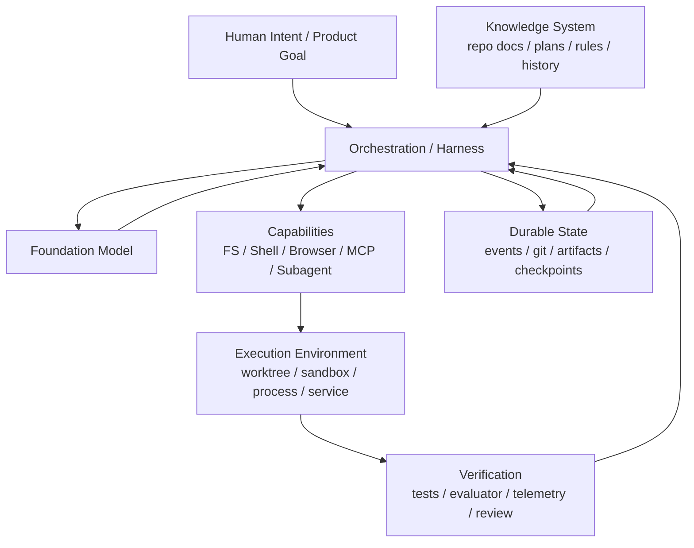
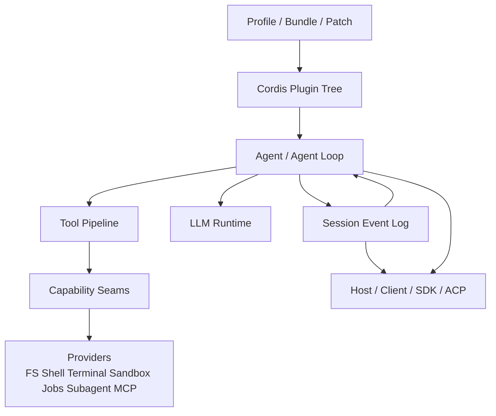
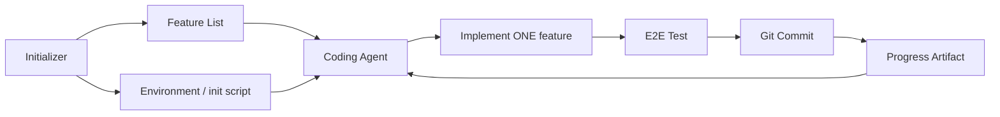
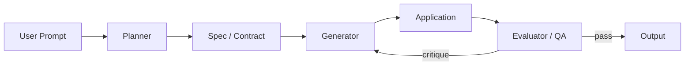
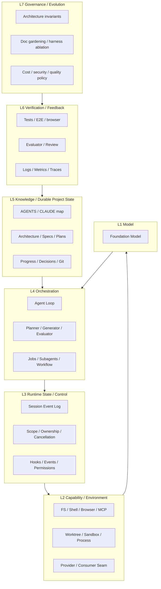
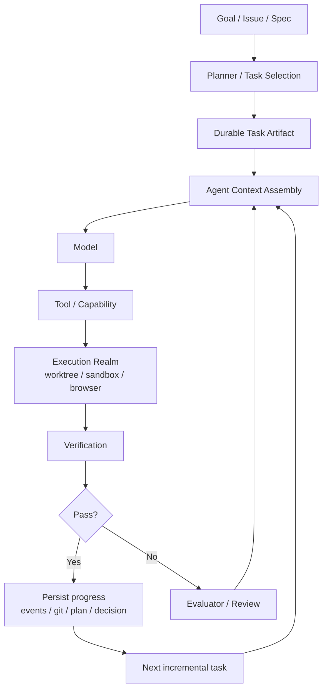
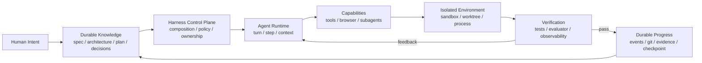

# Agent Harness 工程系统综述：DeepSeek Harness、Codex、Claude Code

> 文档性质：个人源码阅读与 Harness Engineering 综述，不属于 DeepSeek Harness 上游官方文档。
>
> DeepSeek Harness 分析基线：`dsh 0.1.0-rc.7`，commit `99f6f02fecdb7dff40c3fbc9470f5907c29f74ca`。
>
> 外部经验观察窗口：重点覆盖 2026 年 2 月至 2026 年 8 月公开资料，并向前引用少量直接影响当前实践的官方材料。
>
> 目标：不是比较“哪个 coding agent 更强”，而是回答一个更稳定的问题：**当 Agent 从几十秒的工具调用扩展到数小时、多会话、多 Agent、可恢复的软件工程任务后，Harness 必须把哪些复杂性提升为一等工程对象？**

---

# 0. 结论先行

DeepSeek Harness、OpenAI Codex 的 Harness Engineering、Anthropic 的 long-running agent harness，以及过去半年的 Codex / Claude Code 一线使用问题，表面上在讨论不同东西：插件系统、AGENTS.md、context compaction、worktree、subagent、测试、评审、记忆、权限、后台任务。

把这些现象放到同一张系统图里，会发现它们指向同一个结论：

> **Agent 的上限越来越不只由模型决定，而由 Harness 能否把环境、状态、知识、反馈、权限、并发和恢复组织成一个可推理的闭环决定。**

进一步说，成熟 Harness 至少需要同时解决七类问题：

```text
1. Composition     系统由什么组成，如何替换
2. Durable State   哪些事实必须记录，如何恢复
3. Knowledge       Agent 从哪里获得长期正确上下文
4. Capability      Agent 能做什么，能力边界在哪里
5. Control         谁可以做什么，如何拦截、限制、取消
6. Verification    如何知道“真的完成了”，而不是模型自认为完成
7. Recovery        长任务、并发、失败、压缩、重启后如何继续
```

三套实践的关注点不同：

- **DeepSeek Harness** 最强的是 Runtime 内部结构：Cordis 组合、可逆 lifecycle、Session Event Log、Capability Seam、Agent Scope、Job / Subagent、事件化 policy；
- **OpenAI Codex Harness Engineering** 最强的是 Repository / Environment：把仓库变成 Agent 可读、可验证、可执行的“系统记录”，把架构约束、测试、可观测性和产品行为转化为 Agent 可直接操作的反馈回路；
- **Anthropic long-running harness** 最强的是 Temporal Workflow：把长任务切成可恢复的增量工作，用 initializer / planner / generator / evaluator、feature list、progress artifact、Git checkpoint 和 E2E 测试解决跨 context window 的连续性问题。

因此，DeepSeek Harness 源码如果只从“Everything is a Plugin”理解是不够的。更完整的理解应该是：

> **DeepSeek 正在构建 Agent Runtime；OpenAI 展示了如何构建 Agent-Native Repository；Anthropic 展示了如何构建 Long-Running Execution Protocol。真正成熟的 Harness，需要把三者合起来。**

---

# 1. 模块定位（Where）：Harness 在整个 Agent 系统中的位置

## 1.1 不是 LLM Wrapper，也不是 Tool Registry

最简单的 Agent 往往是：

```text
User
  ↓
LLM
  ↓
Tool Call
  ↓
Tool Result
  ↓
LLM
```

当任务只持续一两个 step，这足够。

但 Coding Agent 一旦进入真实工程，会立即遇到：

```text
上下文超过一个窗口
多次模型调用
大量工具输出
进程和后台任务
Git 状态
并行 Agent
审批和权限
UI / SDK / CLI 多入口
重启恢复
错误重试
真实浏览器验证
长期项目知识
架构约束
技术债漂移
```

这时 Harness 实际位于：



因此 Harness 可以理解为：

> **模型与真实世界之间的 Runtime + Control Plane + Feedback System。**

---

# 2. 证据范围：把“源码事实”和“使用经验”分开

本文使用四层证据，权重不同。

## A. DeepSeek Harness 源码与官方 Agent Notes

用于判断：

- 当前实现到底是什么；
- 哪些抽象是显式设计；
- 哪些 trade-off 是项目自己记录的。

核心入口：

- [`docs/architecture.zh.md`](../docs/architecture.zh.md)
- [`docs/cordis-primer.md`](../docs/cordis-primer.md)
- [`packages/core/agent-loop`](../packages/core/agent-loop)
- [`packages/core/session`](../packages/core/session)
- [`packages/core/tools`](../packages/core/tools)
- [`.agents/notes`](../.agents/notes)

## B. OpenAI / Anthropic 官方 Harness Engineering 文章

用于判断两个一线团队经过真实 Agent 工程实践后，认为哪些问题是 load-bearing 的。

## C. Codex / Claude Code 官方产品文档

用于观察当前产品已经把哪些能力提升为一等功能，例如：

- Worktree；
- Subagent；
- Hooks；
- Persistent memory；
- Skills；
- Parallel agents。

## D. GitHub Issues 中的一线用户问题报告

用于寻找“架构在真实使用中哪里容易漏”。

这类证据只能说明：

> 某类 failure mode 在真实用户中出现过。

不能仅凭一个 issue 推断某产品“普遍失败”。本文只把它们作为压力测试样本。

---

# 3. 核心功能（What）：什么叫 Harness Engineering

从三套体系综合来看，Harness Engineering 不是“多加几个 tool”。

更准确的定义是：

> **通过设计模型外部的运行环境、状态结构、能力边界、反馈回路和工程约束，使模型能够稳定完成比单个上下文窗口更长、更复杂、更可验证的任务。**

它解决的是模型本身不会自动解决的系统问题：

```text
模型会推理
≠
系统可恢复

模型会调用工具
≠
工具生命周期正确

模型知道项目规则
≠
规则一定执行

模型能写测试
≠
功能真的可用

上下文能 compact
≠
长期知识不会丢

能 spawn subagent
≠
多 Agent 的权限、目录、成本、取消、结果归属正确
```

这里的关键变化是：

> **把“模型的弱点”从 prompt 问题，重新建模为系统设计问题。**

---

# 4. DeepSeek Harness：Runtime Composability

## 4.1 Where

DeepSeek Harness 的源码结构可以压缩为：



它最独特的不是某个 Agent feature，而是把 Runtime 本身做成可组合系统。

## 4.2 What

核心抽象可以压缩成：

```text
Context
Dependency
Effect
Event
Capability
Scope
Durable Fact
```

其中：

- `Context / inject` 管声明式依赖；
- `effect / dispose` 管可逆生命周期；
- typed event / waterfall 管动态拦截；
- Session Event Log 管 durable facts；
- Definition / Provider / Consumer 管能力替换；
- Agent Scope 管每个 Agent 的局部能力；
- Agent Loop 只推进 Turn / Step。

## 4.3 How：Data Flow

```text
User / external input
      ↓
Agent Inbox
      ↓
pre-step interception
      ↓
Session append(user/message)
      ↓
deriveMessages(SessionEvent Log)
      ↓
Prompt + Tool Schema assembly
      ↓
request/header durable fact
      ↓
LLM
      ↓
assistant/chunk + assistant/message
      ↓
Tool Calls
      ↓
Tool Pipeline / Capability Provider
      ↓
tool/result
      ↓
Session Event Log
      ↓
next step / projection / resume
```

核心不变量是：

> **Model-visible means recorded。**

模型实际看到的东西必须能够从 durable log 重建。

## 4.4 How：Control Flow

```text
Profile / Bundle / Patch
      ↓
Cordis Loader
      ↓
Resolve dependencies
      ↓
Mount plugins
      ↓
Register services / events / effects
      ↓
Agent Loop drives runtime
      ↓
Dispose reverses ownership
```

## 4.5 Why

这是在解决长期 Agent 系统的“组合爆炸”：

```text
LLM × Tool × Policy × Sandbox × UI × Session × Subagent × Deployment
```

如果每种组合都写 special case，Agent Loop 会快速膨胀。

DeepSeek 的回答是：

> 核心不是一个 privileged Agent object；产品是一棵可组合的插件树。

---

# 5. OpenAI Codex：Repository / Environment as Harness

OpenAI 2026-02-11 的《Harness engineering: leveraging Codex in an agent-first world》给出了另一个非常重要的视角。

他们的实验不是“让 Codex 帮忙写一点代码”，而是让一个真实产品的代码、测试、CI、文档、内部工具、可观察性等全部由 Codex 生成，并观察什么环境才能维持高吞吐。

官方文章：

- [Harness engineering: leveraging Codex in an agent-first world](https://openai.com/index/harness-engineering/)
- [中文版本](https://openai.com/zh-Hans-CN/index/harness-engineering/)

## 5.1 核心发现一：人类工作从“写代码”上移到“设计环境”

OpenAI 的描述非常关键：早期速度慢并不是模型不会写代码，而是环境没有提供足够清楚的工具、抽象和反馈。

于是工程师开始不断问：

```text
Agent 为什么卡住？
      ↓
缺的是能力？
缺的是结构？
缺的是可观察性？
缺的是验证？
缺的是可执行约束？
      ↓
把缺失部分编码进环境
```

这意味着：

> **Agent failure 是 Harness backlog 的输入。**

而不是简单重新 prompt 一次。

---

## 5.2 核心发现二：Repo 是系统记录，而 AGENTS.md 只是地图

OpenAI 明确说他们试过“大型 AGENTS.md”，最后失败。

原因包括：

```text
上下文稀缺
规则过多导致注意力稀释
大文件快速腐烂
难以机械校验新鲜度和所有权
```

最后采用的是：

```text
短 AGENTS.md
    ↓
只负责导航
    ↓
ARCHITECTURE.md
Design Docs
Exec Plans
Product Specs
Reliability
Security
Generated References
```

因此长期上下文不应该主要存在于：

```text
Conversation Memory
```

而应该外化成：

```text
Versioned Repository Knowledge
```

这是一个非常深的变化：

> **Conversation 是 cache；Repository 才是 durable knowledge。**

这与 DeepSeek 的 Session Event Log 思想高度同构：两者都在把“隐式上下文”变成可追踪事实，只是作用层不同。

```text
DeepSeek Session Log
负责一次 Runtime / Session 的事实

OpenAI Repository Docs / Plans
负责跨 Session / 跨 Agent / 跨时间的工程事实
```

---

## 5.3 核心发现三：Agent-readable environment

OpenAI 不满足于让 Codex 读源码。

他们把：

- UI；
- 浏览器；
- 日志；
- Metrics；
- Traces；
- Git worktree；

都变成 Agent 可直接读取和操作的环境。

于是 Agent 可以自己：

```text
复现问题
↓
观察 UI / Trace
↓
修改代码
↓
启动独立 worktree 实例
↓
再次观察
↓
验证性能或行为
```

这说明 Harness 的 Capability 不应该只理解成：

```text
Bash / Read / Write
```

更应该理解成：

> **给 Agent 建立一个可观测、可操作、可验证的世界模型。**

---

## 5.4 核心发现四：不变量要机械执行，不要只写在文档里

OpenAI 强调严格的层级依赖和自定义 linter。

例如：

```text
Types → Config → Repo → Service → Runtime → UI
```

只能按规定方向依赖。

这与普通团队架构规范最大的区别是：

```text
“应该这样写”
```

变成：

```text
“不这样写 CI 就失败”
```

这恰好解决了 Coding Agent 的一个基本事实：

> **Instruction 是 soft constraint；machine-checkable invariant 才是 hard constraint。**

---

## 5.5 核心发现五：高吞吐必然产生熵，需要持续垃圾回收

Agent 复制已有模式的能力很强，因此坏模式也会被复制。

OpenAI 后来把所谓“黄金原则”编码成机械规则，并使用后台 Codex 任务持续扫描漂移、更新质量评分、发起重构。

因此 Agent-first 工程不只是：

```text
Generate faster
```

还必须有：

```text
Garbage Collect continuously
```

否则高吞吐只会更快积累技术债。

---

# 6. Anthropic：Long-Running Execution Protocol

Anthropic 的两篇文章解决的不是 Runtime 插件组合，而是：

> 一个 Agent 如何跨多个 context window 持续完成一个大型应用，而不会每次重新理解项目或错误宣布完成。

核心资料：

- [Effective harnesses for long-running agents](https://www.anthropic.com/engineering/effective-harnesses-for-long-running-agents)
- [Harness design for long-running application development](https://www.anthropic.com/engineering/harness-design-long-running-apps)

---

## 6.1 第一阶段：Initializer + Incremental Coding Agent

Anthropic 最开始发现两个典型失败模式。

### Failure A：One-shot syndrome

Agent 尝试一次完成整个应用：

```text
大目标
 ↓
大量代码
 ↓
context 用尽
 ↓
留下半成品
 ↓
下一 Session 不知道刚才发生了什么
```

### Failure B：Premature completion

已有部分功能以后，新的 Agent 看到“已经有不少代码”，容易认为：

```text
差不多完成了
```

实际上大量功能没实现或没验证。

Anthropic 的解决办法是：



关键不是 prompt 更长，而是把任务变成一种**长期执行协议**。

---

## 6.2 Feature list 是外部真源

Anthropic 让 initializer 生成完整 feature list，并把所有 feature 初始设为 failing。

后续 Agent 主要修改状态，不随意重写需求。

这里的思想类似：

```text
模型说“做完了”
≠
系统认为“做完了”
```

完成状态必须依赖外部 artifact。

可以把它理解成：

> **Goal State 被持久化到模型之外。**

---

## 6.3 Git Commit + Progress File = Checkpoint

每次只做一个 feature，然后：

```text
commit
+
progress summary
```

这样下一 Context Window 不需要完全相信 compaction summary。

它可以读取：

```text
git log
progress artifact
feature list
```

重新恢复执行位置。

这实际上是在做：

> **Application-level checkpointing。**

---

## 6.4 E2E Testing 是最关键的外部反馈

Anthropic 发现模型会做 unit test、curl，却仍可能错过真实应用根本不能用。

当提供 browser automation 后，Agent 才能以用户视角：

```text
启动应用
点击
输入
观察
截图
验证
```

这与 OpenAI 的 Chrome DevTools / telemetry agent-readable 环境完全一致。

共同结论是：

> **验证闭环必须尽量接近真实用户世界，而不是只验证代码内部世界。**

---

# 7. Anthropic 第二阶段：Planner → Generator → Evaluator

2026-03-24 的后续文章进一步把长任务扩展为多 Agent 结构：



这里的重要变化不是“3 个 Agent 比 1 个强”。

真正的思想是：

> **Generation 与 Judgment 分离。**

因为让同一个模型：

```text
我写的东西
↓
我自己判断是不是优秀
```

天然容易产生 self-confirmation。

单独 evaluator 可以被调得更严格，并持有独立 rubric。

---

## 7.1 Planner 的价值

Planner 不是为了产生漂亮的计划文档，而是防止 Generator：

```text
看到一句用户需求
↓
立刻开始写
↓
系统性漏掉需求空间
```

Planner 把目标空间显式展开。

---

## 7.2 Evaluator 的价值

Evaluator 把：

```text
“看起来不错”
```

转化为：

```text
明确 criteria
+ 独立观察
+ critique
+ 重新生成
```

对于 Coding Agent，类似模式可以是：

```text
Implementation Agent
        ↓
Review Agent
        ↓
Test / Browser Agent
        ↓
Security Agent
```

但关键是它们必须拥有不同信息角色和不同评价目标，否则只是重复计算。

---

# 8. 一个特别重要的 Anthropic 结论：Harness 也会过时

Anthropic 后续实验发现，Opus 4.6 比 4.5 更擅长规划、长任务和长上下文后，原先一些 scaffold 已经不再必要。

因此他们开始做 ablation：

```text
一次移除一个 Harness 组件
↓
重新评估真实任务表现
↓
判断它是否仍是 load-bearing
```

这给出一个非常重要的原则：

> **Harness 的每个组件，本质上都编码了一个“模型目前做不到什么”的假设。模型升级后，这个假设必须重新验证。**

所以 Harness Engineering 不能只不断加功能。

还需要：

```text
Harness Garbage Collection
```

这和 OpenAI 对代码熵的垃圾回收形成第二种对应：

```text
OpenAI：清理 Agent 生成的代码熵
Anthropic：清理模型升级后失去必要性的 Harness 熵
```

---

# 9. 过去半年的 Codex / Claude Code 一线经验：真正暴露了哪些系统问题

下面不按产品功能罗列，而按 failure class 汇总。

---

## 9.1 Context Compaction：最大的误区是“压缩 = 记忆”

过去半年 Codex 和 Claude Code 的 issue 中，反复出现：

```text
context 到上限
↓
compact 太晚 / compact 失败
```

或者：

```text
compact 成功
↓
但执行位置、约束、已完成工作丢失
↓
Agent 重做旧工作
```

Codex 公开问题样本：

- `openai/codex#25394`：resume 后压缩丢失近期上下文；
- `openai/codex#25900`：compaction 没有保住当前 task checkpoint，出现重复探索；
- `openai/codex#27554`：compact 后丢失 active worktree context；
- `openai/codex#29816`：希望明确保留 AGENTS、验证要求、TODO、blocker、changed files 等 operational state；
- `openai/codex#30194`：高 context thread 需要 out-of-band compaction 或在同一 worktree 上开启 fresh thread。

Claude Code 公开问题样本：

- `anthropics/claude-code#23047` / `#26317`：context 满以后 `/compact` 本身失败；
- `#29890`：compact 后丢失已知失败方案和关键 working knowledge；
- `#31954`：希望更早 proactive compact；
- `#76147`：长会话出现频繁重复 auto-compaction。

这些报告共同说明：

> **Compaction 只能解决 token budget，不应承担 durable state 的唯一职责。**

更可靠的架构应该区分：

```text
Ephemeral Conversation
        ↓ compact
Compressed Working Context

Durable Task State
        ↓ structured checkpoint
Plan / Decisions / Progress / Files / Git / Tests
```

即：

> **压缩回答“当前窗口保留什么”；持久状态回答“系统绝不能忘什么”。**

DeepSeek 的 Session Event Log、OpenAI 的 repo-as-system-of-record、Anthropic 的 feature/progress/git artifacts，其实都是在解决同一个问题的不同时间尺度。

---

## 9.2 Multi-Agent：最大的问题不是 Spawn，而是 Ownership

过去半年两边都在加：

- parallel agents；
- subagents；
- worktrees；
- background agents；
- agent teams。

真实使用马上暴露的问题包括：

```text
Agent 到底在哪个 cwd？
它继承哪个 branch/worktree？
父 Agent 的权限是否继承？
父 hooks 是否传播？
谁取消它？
它的结果回到哪里？
它的 context/storage 谁拥有？
它退出后谁清理 worktree/process？
```

Claude Code issue 样本：

- `#31546`：worktree 内的 subagent 错误回到 main repo root；
- `#27661`：subagent 对 hooks / permission / CLAUDE.md / memory 的继承问题；
- `#40241`：permission mode 没有按预期传播；
- `#48927`：并行 worktree cleanup 的数据丢失型问题；
- `#82418`：agent-team teammate 的 PermissionRequest lifecycle 没有正常回到 orchestrator。

Codex issue 样本：

- `#13120`：用户要求原生 worktree 支持以运行并行 agent；
- `#33196`：并行 subagent 出现极端 token amplification / repeated compaction；
- `#34268`：multi-agent fork + compaction snapshot / image 复制导致巨量 session storage；
- `#20852`：多个 agent 共用 Computer Use surface 时需要明确 session / desktop ownership。

这直接验证了 DeepSeek Harness 源码中我们已经看到的方向：

> **Lifecycle / Scope / Ownership 不是“框架内部优雅性”，而是多 Agent 一旦真实并行就必须解决的正确性问题。**

---

## 9.3 Worktree：不是 Git 小技巧，而是并发隔离原语

Claude Code 当前官方文档已经把 `--worktree`、subagent `isolation: worktree`、`.worktreeinclude` 等作为一等能力。

官方文档：

- [Run parallel sessions with worktrees](https://code.claude.com/docs/en/worktrees)

Codex App 也把 built-in worktrees 作为多 Agent 并行的产品能力。

因此从 Harness 角度，worktree 应被理解成：

```text
Agent Execution Realm
=
Code Snapshot
+ Branch
+ Working Directory
+ Local Config
+ Runtime Instance
```

而不是：

```text
git 的一个高级命令
```

当未来 Agent 数量继续增加，合理的抽象甚至应该进一步统一：

```text
Agent Scope
  ├── Context Scope
  ├── Tool Scope
  ├── Permission Scope
  ├── Process Scope
  ├── Filesystem Realm
  └── Git Worktree Realm
```

---

## 9.4 Instruction / Memory：文档不是强约束

Claude Code 官方文档本身已经区分：

```text
CLAUDE.md = user-written persistent instructions
Auto Memory = agent-learned facts/patterns
```

并明确说明它们是 context，而不是 enforced configuration。

官方文档：

- [How Claude remembers your project](https://code.claude.com/docs/en/memory)

一线 issue 进一步暴露：

- `MEMORY.md` 过大后存在截断风险；
- CLAUDE.md 与 auto-memory 容易职责重叠；
- “把规则写得更强硬”并不能保证模型每次遵循。

这和 OpenAI 的实践形成完全一致的结论：

```text
Soft rule
    ↓
Markdown instruction

Hard rule
    ↓
Lint / Hook / Permission / Schema / CI / Type / Runtime Guard
```

也就是说：

> **规则是否应该被写成 prompt，取决于违反规则是否允许发生。**

如果绝对不能发生，就应该从 prose 下沉为 mechanism。

---

## 9.5 Hooks：Deterministic Control Plane

Claude Code 当前把 lifecycle hooks 做成一等 extension point，包括：

```text
PreToolUse
PostToolUse
PermissionRequest
SubagentStart / Stop
PreCompact / PostCompact
WorktreeCreate / Remove
SessionEnd
FileChanged
```

官方文档：

- [Automate workflows with hooks](https://code.claude.com/docs/en/hooks-guide)
- [Hooks reference](https://code.claude.com/docs/en/hooks)

这与 DeepSeek Harness 的：

```text
agent/*
tools/*
fs/*
waterfall
serial
```

属于同一类设计思想：

> **不要让核心 loop 知道所有策略；给 control plane 提供稳定 interception points。**

区别在于：

- Claude Code 从产品自动化入口描述 hooks；
- DeepSeek Harness 从 Runtime typed-event / capability seam 描述同类机制。

---

## 9.6 Subagent：主要价值之一是 Context Isolation

Claude Code 官方文档对 subagent 的定义里，一个非常重要的价值不是“并行”，而是：

> 把大量探索、日志、文件内容放进独立 context，避免污染主 conversation。

官方文档：

- [Create custom subagents](https://code.claude.com/docs/en/sub-agents)

这给出一个普遍的 context engineering 原则：

```text
不是所有信息都应该回到 Parent Context
```

正确模式应该是：

```text
Raw Exploration
     ↓
Subagent private context
     ↓
Structured Result / Evidence
     ↓
Parent Context
```

否则 multi-agent 不但不省上下文，反而会产生：

```text
N 个 agent 的 full transcript
全部回灌 Parent
```

形成 context amplification。

Codex `#33196` 这种极端 token amplification 报告就是很好的压力测试样本。

---

## 9.7 Long-Running Runtime：资源本身也必须有界

长时间运行后，不只是 token 会增长。

真实 issue 还包括：

```text
process memory
captured stdout
session storage
images
subagent history
MCP process
background task
```

Claude Code 有用户报告长 session 中进程内存显著膨胀；Codex 有 multi-agent 历史复制导致 session storage 激增的报告。

所以长期 Agent Runtime 必须显式管理：

```text
Context Budget
Storage Budget
Output Retention
Process Lifetime
Attachment Lifetime
Job Lifetime
Concurrency Budget
Cost Budget
```

DeepSeek Harness 中的 `output-retention`、Session projection、Job ownership、AttachmentStore、dispose/cancellation 等方向应当从这个角度理解。

---

# 10. 三套体系统一后：Agent Harness 的七层模型

把 DeepSeek、OpenAI、Anthropic 合并，可以得到下面这张更完整的架构图。



这张图里，模型反而只是最底层一个组件。

这不是贬低模型，而是说明：

> **当模型已经足够强以后，系统瓶颈开始外移。**

---

# 11. 工作机制（How）：完整 Long-Running Agent 数据流



注意这里有两个不同的 loop：

```text
Micro Loop
Model → Tool → Model

Macro Loop
Task → Implement → Verify → Persist → Next Task
```

很多 Agent Framework 只实现 Micro Loop。

真正的 Long-Running Harness 必须实现或支持 Macro Loop。

---

# 12. 控制流（Control Flow）：谁拥有什么

成熟 Harness 必须能回答以下 ownership 问题：

```text
Task
  谁决定当前任务？

Context
  谁决定哪些信息进入模型？

Tool
  谁注册，谁授权，谁执行？

Process
  谁 spawn，谁 cancel，谁 reap？

Subagent
  谁创建，继承什么，谁等待，谁 dispose？

Worktree
  谁创建，基于哪个 commit，谁合并，谁清理？

Session
  哪些事实持久化，谁能恢复？

Verification
  谁有权宣布任务完成？
```

如果这些问题只能回答：

```text
“Agent 自己看着办”
```

系统在短 demo 中可能没问题，但长任务和多 Agent 下会变得不可推理。

---

# 13. Critical Path：一个真正可靠的 Coding Agent 最核心路径

把所有花哨能力去掉，最核心路径应当是：

```text
1. Recover durable project/task state
        ↓
2. Select one bounded objective
        ↓
3. Create/resolve isolated execution realm
        ↓
4. Assemble only relevant context
        ↓
5. Execute through controlled capabilities
        ↓
6. Observe real system behavior
        ↓
7. Run independent verification
        ↓
8. Persist progress + evidence + decisions
        ↓
9. Cleanly release resources
        ↓
10. Repeat
```

其中第 8 步决定了第 1 步能不能可靠发生。

所以：

> **Long-running 的关键不是“持续运行”，而是“可以不断安全停止并正确继续”。**

---

# 14. 伪代码：把三套 Harness 思想放进一个最小模型

```python
runtime = compose_runtime(profile)
project = load_project_knowledge(repo)

while not project.goal_satisfied():
    checkpoint = project.recover_checkpoint()

    task = planner.select_bounded_task(
        goal=project.goal,
        feature_state=project.feature_state,
        checkpoint=checkpoint,
    )

    realm = runtime.realms.create_isolated(task)

    try:
        context = context_builder.build(
            task=task,
            repo_map=project.repo_map,
            decisions=project.relevant_decisions(task),
            rules=project.relevant_rules(task),
            session=runtime.session,
        )

        result = agent.run(
            context=context,
            capabilities=runtime.capabilities.scoped(realm),
            signal=realm.signal,
        )

        evidence = verifier.evaluate(
            implementation=result,
            realm=realm,
            tests=task.acceptance_tests,
        )

        if not evidence.pass_:
            runtime.session.append(evidence)
            continue

        project.persist(
            task_state='done',
            decisions=result.decisions,
            evidence=evidence,
            git_checkpoint=realm.git.commit(),
        )

    finally:
        await realm.dispose()
```

这里最重要的不是 Python 语法，而是：

```text
recover
bound
isolate
scope
verify
persist
dispose
```

这七个动作。

---

# 15. 为什么 DeepSeek Harness 的源码设计很重要

有了 OpenAI / Anthropic 的经验以后，再看 DeepSeek，会发现很多源码设计不是“过度抽象”。

## 15.1 Session Event Log

外部实践反复证明 compaction 会丢语义。

DeepSeek 选择：

```text
Durable fact first
Projection second
```

这个方向是对的。

尤其 rc.7 的 replay degradation 修复进一步体现：

```text
Durable content
>
Provider fidelity metadata
```

系统宁愿损失一部分 replay fidelity，也不能让历史 metadata 把 Session 永久毒死。

---

## 15.2 Capability Seam

外部实践里，Browser、Worktree、Shell、Permissions、Computer Use 都会出现 provider/environment 差异。

DeepSeek 的：

```text
Definition
Provider
Consumer
```

意味着这些变化可以沿能力边界吸收，而不是进入 Agent Loop。

---

## 15.3 Scope / Ownership / Cancellation

多 Agent 的公开问题报告已经证明：

```text
cwd
permission
hook
worktree
process
result
```

一旦继承关系不明确，就会直接变正确性 bug。

所以 DeepSeek 强调：

```text
agent.ctx
FactoryOwnership
AbortSignal
dispose
```

是非常有现实依据的设计。

---

## 15.4 Typed Events / Waterfall

Claude Hooks 和 OpenAI 的 policy/invariant 经验说明：

> Runtime 必须提供 deterministic interception point。

否则所有约束都只能依赖模型“记得做”。

DeepSeek 的 `agent/*`、`tools/*`、`fs/*` 应从 Control Plane，而不是 EventBus Utility 的角度理解。

---

# 16. 但 DeepSeek Harness 还不能被误解成“已经解决了所有 Harness 问题”

DeepSeek rc.7 的 Runtime 架构很强，但 OpenAI / Anthropic 的经验提示我们，下面几类问题不能仅靠 Cordis 自动解决。

## 16.1 Repository Knowledge Architecture

Session Log 能恢复会话事实，但无法自动回答：

```text
跨几个月的架构决策在哪里？
当前产品 spec 是什么？
哪条团队规则仍然有效？
哪些技术债正在跟踪？
```

这需要类似 OpenAI：

```text
repo-as-system-of-record
```

的知识层。

DeepSeek 自己的 `.agents/notes` 已经非常接近这一思想：它把 Problem / Decision / Alternatives / Consequences 版本化在仓库中。

这可能是 DeepSeek Harness 最容易被低估的一部分。

---

## 16.2 Macro-level Long-Running Protocol

Agent Loop 的 Turn / Step 状态机解决的是 micro orchestration。

但：

```text
一个 6 小时任务如何拆？
一轮结束后留下什么 checkpoint？
谁选择下一个 feature？
什么条件允许宣布整个目标完成？
```

仍需要上层 workflow / plan / job / evaluator protocol。

Anthropic 的实验对这里非常有参考价值。

---

## 16.3 Verification Harness

DeepSeek 有 tool pipeline、有 Web、有 MCP、有 subagent，但真正的 E2E 验证仍然是 domain-specific：

```text
Web → Browser
Backend → Integration Environment
Performance → Metrics / Trace
Embedded → Device / Video / Hardware
```

Harness 核心最多提供 seam；真正的“完成定义”仍需工程团队构建。

---

## 16.4 Parallel Execution Realm

多 Agent 真正可靠并行，需要一个比“spawn subagent”更完整的 realm：

```text
workspace
filesystem
process
network
permission
git
credentials
lifecycle
```

Claude / Codex 的 worktree 经验提示，这可能是未来 DeepSeek Harness 值得重点观察的方向。

---

# 17. 三套体系对比矩阵

| 维度 | DeepSeek Harness | OpenAI Codex Harness Engineering | Anthropic Long-Running Harness |
|---|---|---|---|
| 核心问题 | Runtime 如何可组合 | Repo / 环境如何让 Agent 高吞吐可靠工作 | 多 Context Window 如何连续完成大任务 |
| 核心状态 | Session Event Log | Git + Docs + Plans + CI + Observability | Feature list + Progress + Git checkpoint |
| 组合模型 | Cordis Plugin Tree | Repo / tools / process conventions | Planner / Generator / Evaluator workflow |
| 扩展方式 | Service / Event / Effect / Capability Seam | Skills / tools / repo-local automation | Agent roles + structured artifacts |
| 长期记忆 | Durable Session facts | Repository as system of record | Handoff artifacts |
| 硬约束 | Typed runtime boundaries / guard / policy | Linter / structural tests / CI | Feature state / test protocol / evaluator |
| 并发 | Jobs / Subagent / Scope | Parallel Codex + worktrees | Multi-agent roles |
| 验证 | Tool pipeline 提供机制，具体能力插件化 | Browser + logs + metrics + traces | Browser automation + independent evaluator |
| Lifecycle | 强：effect/dispose/ownership | 更多依赖执行环境与产品 supervisor | 主要由 harness workflow 管 session 交接 |
| 最大启示 | Composability + durability | Agent-readable system + enforceable invariants | Incremental progress + independent evaluation |
| 最大风险 | 抽象复杂度过高 | 高吞吐导致熵与治理成本 | Harness 过重、成本高、随模型升级过时 |

---

# 18. 设计动机（Why）：为什么现在 Harness 比过去重要

过去的软件工程自动化通常假设：

```text
程序行为确定
输入输出边界明确
流程由人设计
```

Agent 系统恰好相反：

```text
模型决策具有概率性
上下文有限
调用路径动态
会自己选择工具
会产生大量新代码
会改变未来 Agent 看到的环境
```

因此需要把更多边界外置并机械化：

```text
概率性决策
放在约束内部

确定性规则
放在 Harness 中
```

最终形成：

> **中央强边界，局部高自主。**

这既是 OpenAI 文章的经验，也是 DeepSeek Capability / Scope 架构自然追求的状态。

---

# 19. 替代方案（Trade-off）

## 19.1 一个超级 Agent + 超长 Context

优点：

```text
简单
少 orchestration
减少 handoff
```

问题：

```text
context 成本
compaction 损失
长期状态不可验证
single failure domain
任务容易 one-shot / premature done
```

所以长 context 可以缓解，但不能替代 durable state。

---

## 19.2 大型 AGENTS.md / CLAUDE.md

优点：

```text
低成本
直接
```

问题：

```text
context crowding
腐烂
规则优先级混乱
无法机械执行
```

更适合作为 Map，而不是 Database / Policy Engine。

---

## 19.3 所有问题都用 Subagent

优点：

```text
并行
context isolation
角色专业化
```

问题：

```text
token amplification
coordination overhead
worktree conflict
permission inheritance
storage duplication
结果合并
```

Subagent 应该对应独立、可边界化的问题，不应该成为默认函数调用。

---

## 19.4 Harness 无限加复杂度

这是另一个极端。

每增加：

```text
Planner
Evaluator
Memory Layer
Task Manager
Workflow DSL
Custom Tool
```

都应该问：

> 当前模型在真实任务上，没有它真的明显变差吗？

Anthropic 的 ablation 思路应当成为 Harness 本身的维护原则。

---

# 20. 性能关键点

Harness 的性能不能只看 CPU overhead。

真正成本至少包含：

## 20.1 Token / Context

```text
instruction size
repo context
subagent fan-out
raw tool output
compaction frequency
replay/history duplication
```

复杂度可能从单 Agent 的：

```text
O(context)
```

放大成多 Agent 的：

```text
O(N_agents × context × handoff)
```

如果结果不断相互回灌，实际可能更糟。

---

## 20.2 IO / Storage

```text
Session Event Log
assistant chunks
attachments
screenshots
browser artifacts
worktrees
subagent transcripts
```

都需要 retention / compaction / GC 策略。

---

## 20.3 Wall-clock

并行 Agent 并不意味着线性加速。

必须看：

```text
可并行工作比例
环境启动时间
测试串行瓶颈
merge conflict
review latency
shared external resource
```

---

## 20.4 Human Attention

OpenAI 的核心观察之一是：

> 人类时间和注意力成为最稀缺资源。

因此 Harness 的优化目标最终应该从：

```text
tokens / second
```

扩展到：

```text
verified useful work / human attention
```

这是评估 Agent 工程效率更合理的总指标。

---

# 21. 工程启示（Takeaway）：可迁移的 Harness 原则

这份综述最终可以压缩成十二条工程规则。

### 1. Conversation 不是数据库

重要事实必须进入 durable artifact。

### 2. Compaction 不是 memory

它只是 working-set compression。

### 3. AGENTS.md / CLAUDE.md 是地图，不是世界

复杂知识应渐进式披露。

### 4. Prose 是软约束

不可违反的规则要变成 lint / hook / schema / permission / runtime guard。

### 5. Agent Loop 不应该拥有整个世界

控制流、状态、能力、UI、policy 分开。

### 6. 新能力先找变化轴

只有真实存在 provider / consumer 独立变化时，才建立 seam。

### 7. 所有异步工作必须有 owner

Agent、Job、Process、Subagent、Worktree 都必须能回答谁取消、谁等待、谁清理。

### 8. 多 Agent 的第一问题是隔离，不是并行

Context、cwd、FS、Git、权限和资源必须先隔离。

### 9. 验证必须尽可能接近用户世界

代码可编译不等于产品可用。

### 10. Generation 与 Evaluation 尽量解耦

尤其对于高价值、长周期任务。

### 11. 高吞吐必须配 Garbage Collection

既清理代码熵，也清理已经失去作用的 Harness scaffold。

### 12. 衡量 Harness 的标准不是功能数量

真正标准是：

> **失败以后，系统是否仍然知道发生了什么、现在在哪里、下一步该做什么，而且能继续。**

---

# 22. 对 DeepSeek Harness 后续源码阅读的调整

基于这份综述，后续不应该只按 package 阅读，而应建立七条研究主线。

```text
R1 Composition
Cordis / Profile / Bundle / Patch

R2 Durable State
Session / Persistence / Replay / Compaction

R3 Execution
Agent Loop / Tool Pipeline / LLM

R4 Ownership
Scope / Abort / Jobs / Subagent / Process

R5 Control
Permissions / Sandbox / Guards / Events

R6 Long-running
Plan / Goal / Workflow / Checkpoint / Recovery

R7 Agent-native Engineering
.agents/notes / docs / tests / generated graphs / release gates
```

其中外部经验提示我们尤其应该追三个问题：

```text
A. DeepSeek 如何定义跨 Context Window 的“任务执行位置”？
B. 多 Agent 的 execution realm 最终会抽象到什么程度？
C. Runtime durable state 与 repository durable knowledge 是否会进一步融合？
```

这三个问题比“又新增了什么工具”更值得长期追踪。

---

# 23. 版本演进判断框架

以后每次 DeepSeek Harness release，不建议只做 changelog。

应该把变化映射到：

```text
Composition
State
Knowledge
Capability
Control
Verification
Recovery
```

然后问：

```text
这次变化是在加 feature？
还是在修一个 abstraction leak？
还是在补一个新的 ownership boundary？
还是把 soft convention 变成 hard invariant？
还是删除已经不再 load-bearing 的 scaffold？
```

这样才能判断它在 Harness 演进中的真实位置。

---

# 24. 最终系统模型

把目前所有证据压缩成一张图：



这个闭环比任何单独一个“Agent Framework”定义都更接近未来 Agent 工程系统的真实形态。

一句话总结：

> **模型负责在边界内寻找解；Harness 负责定义边界、保存事实、提供世界、验证结果，并保证失败以后还能继续。**

---

# 25. 参考资料

## DeepSeek Harness

- [DeepSeek Harness repository](https://github.com/deepseek-ai/deepseek-harness)
- [DeepSeek Harness architecture](../docs/architecture.zh.md)
- [Module graph](../docs/module-graph.zh.md)
- [Tool execution pipeline](../docs/tool-execution-pipeline.md)
- [Agent Notes](../.agents/notes)

## OpenAI

- [Harness engineering: leveraging Codex in an agent-first world](https://openai.com/index/harness-engineering/)
- [工程技术：在智能体优先的世界中利用 Codex](https://openai.com/zh-Hans-CN/index/harness-engineering/)
- [Introducing the Codex app](https://openai.com/index/introducing-the-codex-app/)
- [Codex](https://openai.com/codex/)
- [How agents are transforming work](https://openai.com/index/how-agents-are-transforming-work/)
- [Running Codex safely at OpenAI](https://openai.com/index/running-codex-safely/)
- [openai/codex issues](https://github.com/openai/codex/issues)

重点一线问题样本：`#25394`、`#25900`、`#27554`、`#29816`、`#30194`、`#33196`、`#34268`。

## Anthropic

- [Effective harnesses for long-running agents](https://www.anthropic.com/engineering/effective-harnesses-for-long-running-agents)
- [Harness design for long-running application development](https://www.anthropic.com/engineering/harness-design-long-running-apps)
- [Run parallel sessions with worktrees](https://code.claude.com/docs/en/worktrees)
- [Create custom subagents](https://code.claude.com/docs/en/sub-agents)
- [Run agents in parallel](https://code.claude.com/docs/en/agents)
- [Automate workflows with hooks](https://code.claude.com/docs/en/hooks-guide)
- [Hooks reference](https://code.claude.com/docs/en/hooks)
- [How Claude remembers your project](https://code.claude.com/docs/en/memory)
- [anthropics/claude-code issues](https://github.com/anthropics/claude-code/issues)

重点一线问题样本：`#23047`、`#26317`、`#29890`、`#31954`、`#76147`、`#31546`、`#27661`、`#40241`、`#48927`、`#82418`。

---

# 26. 后续研究

这篇综述是上层模型，不替代源码考古。接下来最有价值的是把这些外部问题逐一映射回 DeepSeek Harness 源码：

```text
Context loss
→ Session / Compaction / Replay

Parallel-agent isolation
→ Scope / Subagent / Jobs / Workspace

Permission inheritance
→ Tool Pipeline / Guard / Sandbox

Task checkpoint
→ Goal / Plan / Workflow / Session Event

Repository system-of-record
→ .agents/notes / docs / generated invariants

Evaluator loop
→ Subagent / Jobs / Workflow / Tool verification
```

只有完成这种“外部 failure mode → 内部 abstraction → 真实源码路径”的映射，才算真正理解 DeepSeek Harness，而不是只理解它的 API。
