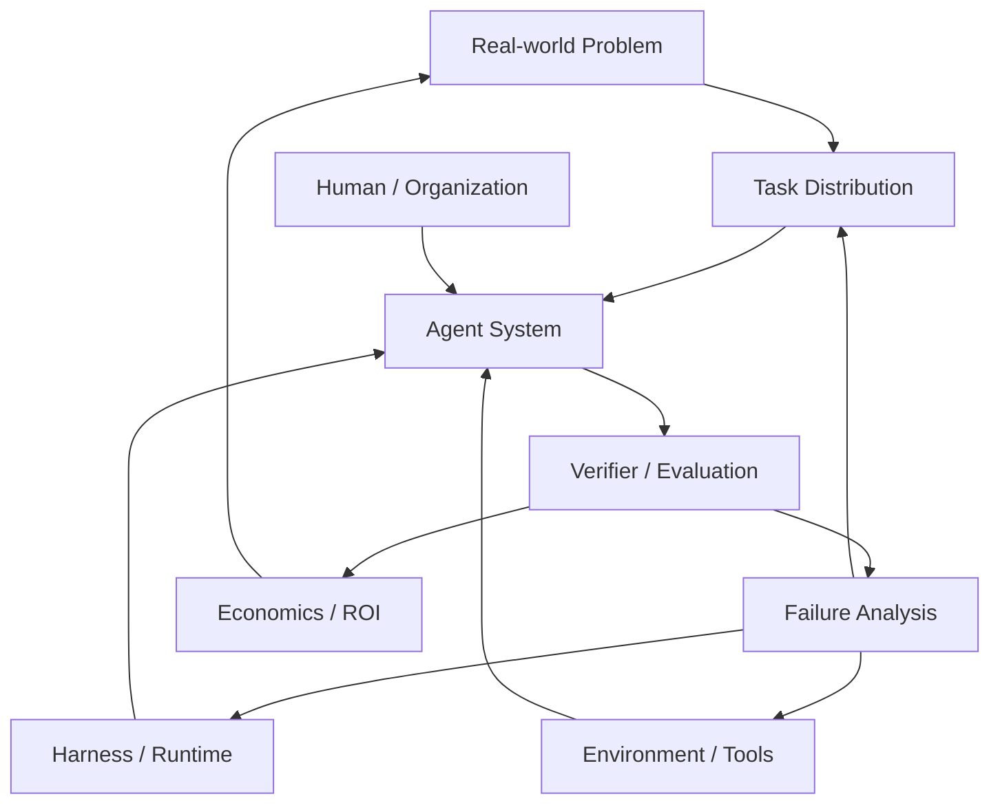

# 从 Harness-first 到 Problem-first：Agent 系统研究的正确因果方向

> 文档性质：个人研究判断，不属于 DeepSeek Harness 上游官方观点。
>
> 观察基线：2026-08-18；DeepSeek Harness 仍处于早期快速演进阶段，因此本文刻意把“源码事实”“公开战略信号”和“我的推断”分开。
>
> 核心问题：**DeepSeek 已经通过开放模型取得巨大生态成功，这条路径能否自然复制到 Harness？如果不能，Harness 真正应该研究什么？**

---

# 0. 结论先行

我目前最重要的判断是：

> **Harness 不应该成为研究的最终对象。真正的研究对象应该是：Agent 如何在现实世界中稳定完成长期、复杂、可验证、具有经济价值的任务。Harness 只是为解决这些任务而逐渐长出来的系统结构。**

因此，更合理的因果顺序是：

```text
真实问题
    ↓
Agent 在真实环境中失败
    ↓
识别可重复的 failure mode
    ↓
提出最小 Harness intervention
    ↓
严格验证 / ablation
    ↓
跨任务重复出现
    ↓
形成稳定 abstraction
    ↓
形成 framework / plugin interface
    ↓
最后才可能形成 ecosystem / standard
```

而不是：

```text
先设计通用 Runtime
    ↓
先定义插件边界
    ↓
先构建生态
    ↓
希望未来真实问题自然进入这个框架
```

后者不是一定失败，但风险很高，因为它把**结果当成了起点**。

DeepSeek Harness 的 `Everything is a Plugin` 很有工程美感；真正需要持续验证的问题却不是“还可以插件化什么”，而是：

> **哪些插件、生命周期、状态、能力边界和控制面，是被真实任务反复逼出来的 load-bearing structure？**

如果回答不了这个问题，Harness 很容易从 Agent Systems Engineering 滑向 Framework Engineering。

---

# 1. 为什么 DeepSeek 容易自然地走向“再造一个开放生态”

这是一个非常合理的路径依赖。

DeepSeek 过去在模型层的成功大致符合下面的扩散逻辑：

```text
强模型
  +
低使用门槛
  +
开放权重 / 开放技术影响力
        ↓
全球开发者直接接入
        ↓
大量下游应用无需改变模型本体
        ↓
规模化采用
        ↓
事实标准与生态影响力
```

模型很适合这种路线，因为它具有较强的**标准化接口**：

```text
Input  = tokens / multimodal input
Output = tokens / structured output
API    = 相对稳定
Eval   = 可以跨组织比较
Serving= 可以被通用推理框架承载
```

一个模型即使完全不知道用户的业务，也仍然可以产生广泛价值。

于是很容易形成一种战略惯性：

> 既然“做出强基础能力 → 开放 → 社区采用 → 形成生态”在模型层成功过，那么 Harness 是否也可以这样做？

DeepSeek Harness 当前公开定位中的：

```text
Everything is a Plugin
```

以及高度可组合的 Cordis / capability / lifecycle 设计，确实显示出一种非常强的“开放 Agent Runtime”取向。

这条路线本身有价值；问题在于：

> **模型和 Harness 并不是同一种经济品，也不是同一种工程抽象。**

---

# 2. 模型开源的成功逻辑，为什么不能直接平移到 Harness

## 2.1 模型能力具有高度可迁移性，Harness 能力高度依赖环境

一个强语言模型可以同时被用于：

```text
Coding
Math
Search
Writing
Customer Support
Research
Data Analysis
```

它的能力主体仍然是同一个模型。

但一个真正有效的 Harness 往往依赖：

```text
任务状态
工具集合
权限模型
文件系统
数据库
浏览器
代码仓库
测试环境
组织流程
人类审批
成本约束
失败恢复
领域规则
真实反馈
```

所以：

```text
优秀的软件工程 Harness
≠ 优秀的金融分析 Harness
≠ 优秀的机器人 Harness
≠ 优秀的视觉算法研发 Harness
≠ 优秀的客服运营 Harness
```

它们可能共享 runtime primitives，但决定效果的 load-bearing structure 往往出现在更靠近任务的一层。

这意味着 Harness 的价值分布更像：

```text
通用 Runtime Primitive        可共享
        ↓
Long-running Protocol         部分共享
        ↓
Domain Workflow               高度任务相关
        ↓
Verifier / Environment        极度任务相关
        ↓
Business Outcome              完全由现实问题定义
```

因此，Harness 的“通用层”比模型更薄，而“任务相关层”比模型更厚。

---

## 2.2 模型可以脱离业务证明自己，Harness 很难

模型可以通过相对独立的 benchmark 获得可信度：

```text
数学正确率
代码任务通过率
推理 benchmark
多模态 benchmark
```

Harness 则很难脱离一个具体任务分布谈“更强”。

例如：

```text
增加 planner
增加 memory
增加 subagent
增加 workflow DSL
增加 plugin system
```

这些都不能自动推出：

```text
任务完成率上升
人工介入下降
耗时下降
成本下降
错误率下降
长期稳定性上升
```

甚至可能相反。

所以 Harness 的证据结构必须是：

```text
明确任务分布
+
明确 baseline
+
明确 verifier
+
明确 failure class
+
明确 intervention
+
明确成本
+
明确 ablation
```

否则很容易把“系统复杂度增加”误认为“Agent 能力增加”。

---

## 2.3 Harness 抽象更容易被复制，任务知识更难被复制

如果一个 Harness 证明：

```text
worktree isolation 有效
structured checkpoint 有效
independent evaluator 有效
hook / permission boundary 有效
```

竞争产品很快就可以吸收。

真正难复制的通常不是这些 primitives，而是：

```text
真实任务数据
长期 failure corpus
领域知识
隐藏边界条件
组织工作流
可靠 verifier
异常恢复经验
用户反馈
人类判断被机械化的过程
```

也就是说：

> **Harness architecture 往往会快速商品化；Problem knowledge 和 Evaluation knowledge 才更容易形成长期复利。**

所以如果一个 Harness 项目的核心资产主要是：

```text
Plugin API
Runtime abstraction
Tool registry
Workflow syntax
```

它的领先很可能是暂时的。

如果核心资产逐渐变成：

```text
我们连续处理了 10000 个真实任务
我们知道其中 37 类系统性失败
其中 12 类可以由 runtime 机制稳定消除
其中 8 类需要 domain verifier
其中 5 类仍然只能升级给人
```

那才开始出现真正的研究壁垒。

---

# 3. 最危险的倒置：Framework-first Development

一个成熟 abstraction 正常应该经历：

```text
多个具体问题
    ↓
重复代码 / 重复失败
    ↓
发现稳定变化轴
    ↓
识别真正 invariant
    ↓
抽象接口
```

Framework-first 则是：

```text
先相信未来需要一个通用系统
    ↓
先定义核心 object model
    ↓
先设计扩展点
    ↓
先建立插件生态
    ↓
再寻找足够多的真实问题证明这些扩展点合理
```

这里最大的风险不是“代码写复杂了”，而是形成一种**认知锁定**：

> 当现实问题与框架不匹配时，团队开始修改问题的表达方式，让它适合框架，而不是修改框架去服从现实问题。

随后容易出现几个信号：

```text
新增 feature 很多
真实 end-to-end case 很少

插件数量增长
可验证任务完成率未知

架构图越来越完整
failure taxonomy 仍然很薄

抽象边界越来越稳定
但没有足够业务证据证明它们应该稳定
```

这才是我对 Harness-first 最核心的担忧。

---

# 4. “研究真正的业务问题”不等于“做几个行业 Demo”

这里必须避免另一个误区。

所谓 Problem-first，不是：

```text
做一个金融 Agent
做一个客服 Agent
做一个医疗 Agent
```

然后把现有 Harness 套进去。

这仍然可能只是 vertical demo。

真正值得 Harness 研究的业务问题，至少应该同时具备以下性质。

## 4.1 Long-horizon

任务不是一次模型调用可以完成，而是持续：

```text
30 min
3 h
1 day
1 week
甚至长期存在
```

这样才会真实暴露：

```text
context decay
checkpoint
recovery
state drift
resource leak
human escalation
```

---

## 4.2 Environment-grounded

Agent 必须面对真实世界状态，而不是只生成文本：

```text
Git repository
browser
database
CI
cloud environment
hardware
ticket system
experiment platform
production telemetry
```

只有这样，Harness 才需要认真处理 capability、permission、ownership、isolation 和 observation。

---

## 4.3 Verifiable

必须能够回答：

```text
到底完成了吗？
到底做对了吗？
到底比 baseline 好了吗？
```

优先选择拥有强 verifier 的问题：

```text
test
benchmark
simulation
business metric
human rubric
physical measurement
replayable environment
```

没有 verifier，Agent 很容易把“生成了结果”误认为“完成了任务”。

---

## 4.4 Repeated and economically meaningful

问题必须现实中反复发生，而且失败有成本。

例如：

```text
每天几十次
每周持续发生
多人重复处理
一次失败需要数小时返工
错误可能造成生产事故
```

只有这样，Harness intervention 才能和真实 ROI 建立联系。

---

## 4.5 Rich failure surface

最好的研究任务不是 Agent 已经轻松完成的任务，而是：

```text
模型看起来已经很强
但总在某些边界条件系统性失败
```

因为只有 failure density 足够高，才能产生新的系统知识。

---

# 5. Harness 真正应该积累的不是 Feature，而是 Failure Knowledge

如果从 Problem-first 重新定义研究资产，那么最核心的知识库不应该是：

```text
我们支持多少工具
我们支持多少插件
我们支持多少 Provider
```

而应该是：

```text
Failure F001: context reset 后重复已完成工作
Failure F002: subagent cwd / worktree ownership 错误
Failure F003: model 自己宣布完成但 E2E 失败
Failure F004: tool output 过长导致后续 reasoning 偏移
Failure F005: permission inheritance 与父 Agent 不一致
Failure F006: stale project knowledge 进入 context
Failure F007: 多 Agent 修改共享资源发生隐式冲突
Failure F008: verifier 本身被 Agent 输出污染
...
```

每个 failure 都应该带：

```text
触发条件
最小复现
任务分布
影响范围
可观测信号
当前 workaround
候选机制
实验结果
是否跨模型复现
是否跨领域复现
模型升级后是否仍存在
```

这样才会形成真正可复用的 Agent Systems Engineering 知识。

换句话说：

> **Feature roadmap 应该从 failure corpus 中长出来。**

而不是反过来。

---

# 6. 一个更严格的研究单元：Task × Environment × Verifier × Economics

单纯讨论“Agent + Harness”仍然太抽象。

一个真正可比较的研究单元至少应该包含四部分：

```text
Task Distribution
    ×
Environment
    ×
Verifier
    ×
Economics
```

## Task Distribution

不是一个漂亮 case，而是一组具有分布特征的任务：

```text
简单 / 困难
常见 / 长尾
已知 / 新颖
短期 / 长期
```

## Environment

Agent 实际可以观察和改变什么：

```text
工具
文件
进程
网络
权限
外部系统
```

## Verifier

什么事实允许系统宣布成功：

```text
tests pass
E2E pass
metric threshold
independent review
human acceptance
```

## Economics

不仅看 token，还看：

```text
wall-clock
compute cost
human attention
review burden
failure recovery cost
business value
```

如果没有这四部分，所谓“某 Harness 更强”通常是不完整的。

---

# 7. Harness intervention 必须接受 Ablation，而不是只接受 Demo

每增加一个机制，都应该问：

```text
没有它会怎样？
```

例如：

```text
Planner
Evaluator
Memory Layer
Subagent
Worktree
Checkpoint
Plugin abstraction
Long-running supervisor
```

都应该进行至少三种比较：

```text
A. without intervention
B. with intervention
C. stronger model without intervention
```

第三项尤其重要。

因为 Anthropic 的公开工程经验已经反复提示：

> Harness 往往编码了“模型目前做不到什么”的假设；模型升级后，一些 scaffold 会失去必要性。

如果一个机制：

```text
模型升级后自然消失
```

它可能只是 temporary scaffold。

如果一个机制即使模型增强仍然重要，例如：

```text
权限隔离
审计日志
真实 verifier
资源 ownership
生产环境边界
```

它才更可能属于长期系统 abstraction。

因此可以把 Harness 机制分成：

```text
Model-compensation layer
解决当前模型弱点

System-invariant layer
解决即使模型再强也必须存在的现实系统约束
```

这两个层次不应该混在一起。

---

# 8. Anthropic / OpenAI 为什么给了另一种更有价值的研究信号

这里不是说 Anthropic 或 OpenAI 没有通用 Harness，也不是说它们一定采取更正确的战略。

更重要的是它们公开材料中呈现出来的**证据生成方式**不同。

## OpenAI：从真实产品反推 Harness

OpenAI 的 Harness Engineering 不是先提出一套 universal framework，再展示 feature。

公开实验本身就是：

```text
真实产品
真实用户
真实 repository
真实 CI
真实 bug
真实 performance constraint
```

然后不断问：

```text
Agent 为什么失败？
缺什么工具？
缺什么文档结构？
缺什么反馈？
缺什么机械约束？
```

这形成：

> **Agent failure → environment backlog。**

最终出现 repo-as-system-of-record、agent legibility、mechanical invariants、continuous garbage collection 等方法。

这些方法之所以有说服力，不只是因为架构合理，而是因为它们是在持续维护真实产品时被逼出来的。

参考：

- [Harness engineering: leveraging Codex in an agent-first world](https://openai.com/index/harness-engineering/)
- [An open-source spec for Codex orchestration: Symphony](https://openai.com/index/open-source-codex-orchestration-symphony/)

---

## Anthropic：从长任务 failure mode 反推 protocol

Anthropic 的 long-running harness 工作同样是：

```text
让 Agent 真做长任务
    ↓
出现 one-shot syndrome
premature completion
handoff failure
weak E2E verification
    ↓
增加 initializer
feature list
progress artifact
git checkpoint
browser verification
    ↓
继续实验
    ↓
再做 harness ablation
```

它关注的是：

> **Agent 在任务里为什么失败？**

而不是：

> **我们的 Framework 还能支持什么抽象？**

参考：

- [Effective harnesses for long-running agents](https://www.anthropic.com/engineering/effective-harnesses-for-long-running-agents)
- [Harness design for long-running application development](https://www.anthropic.com/engineering/harness-design-long-running-apps)
- [Scaling Managed Agents: Decoupling the brain from the hands](https://www.anthropic.com/engineering/managed-agents)

这类研究路径更接近实验科学：

```text
problem
→ observation
→ hypothesis
→ intervention
→ evaluation
→ abstraction
```

---

# 9. 因此，Harness 更像“实验装置”，不是“自然科学对象”

可以用一个类比理解：

```text
目标：理解飞机如何稳定飞行

风洞：极其重要
但风洞不是最终研究对象
```

对应 Agent：

```text
目标：理解 Agent 如何稳定完成现实复杂任务

Harness：极其重要
但 Harness 不是最终研究对象
```

如果研究最后变成：

```text
风洞还可以增加什么接口？
```

而不是：

```text
飞机在哪些气动条件下失稳？
什么结构能解决？
```

研究方向就发生了偏移。

所以我更愿意使用：

```text
Agent Systems Engineering
```

作为上位概念。

Harness Engineering 只是其中一部分：



这里：

```text
Problem 在上
Harness 在下
Evidence 闭环围绕 Problem 运转
```

---

# 10. 一个新的核心指标：Verified Useful Work / Human Attention

Harness 最容易优化错误的东西。

例如：

```text
token/s
steps/run
tool calls
并行 Agent 数
插件数量
运行时吞吐
```

这些都只是中间指标。

更接近真实价值的总指标应该是：

```text
Verified Useful Work
--------------------
Human Attention
```

即：

> **每消耗一单位人类注意力，系统能产出多少经过验证、真正有用的工作。**

必要时再加成本约束：

```text
Verified Useful Work
--------------------------------
Human Attention × Compute Cost
```

这个指标会自然惩罚很多“看起来很 Agentic”的设计：

```text
大量 subagent 互相讨论
但人仍要花很久审查

自动生成很多 PR
但错误率高、返工多

workflow 很复杂
但任务完成率没有提高
```

它也解释了为什么 OpenAI 在 Harness Engineering 中把 human time and attention 视为稀缺资源。

---

# 11. 另一个需要警惕的量：Generalization Debt

Framework-first 很容易积累一种普通技术债之外的债务：

> **Generalization Debt：在证据不足时过早为未来场景做出的通用化承诺。**

例如：

```text
提前支持十种 Provider
提前建立多层 Plugin API
提前保证任意 Agent role 可组合
提前设计通用 workflow semantics
```

这些设计未来都要维护兼容性。

如果真实任务最后只需要其中很小一部分，那么系统已经承担了：

```text
API stability cost
mental model cost
test matrix cost
backward compatibility cost
debugging cost
```

而没有获得对应业务价值。

因此新 abstraction 的准入条件应该是：

```text
至少两个独立真实问题出现同类需求
        ↓
确认存在稳定 invariant / variation axis
        ↓
抽象
```

而不是：

```text
理论上以后可能有人需要
        ↓
抽象
```

---

# 12. 对 DeepSeek Harness 的三个未来路径判断

目前还太早，不能断言 DeepSeek Harness 最终会走哪一条。

但可以建立三个可证伪路径。

## Path A：Plugin Ecosystem-first

```text
Runtime 快速扩展
插件迅速增加
社区热度很高
真实任务证据不足
```

可能结果：

```text
短期生态繁荣
        ↓
基础能力被 Codex / Claude / OpenCode / SDK 吸收
        ↓
插件 API 逐渐商品化
        ↓
项目需要持续依靠社区规模维持差异
```

这是我目前最担心的路径。

---

## Path B：Hard Problem-first

DeepSeek 选择一个或几个真正困难的问题，例如：

```text
大型代码库持续自治维护
长期研究任务
复杂数据分析
真实 DevOps / incident response
```

连续运行数月，公开：

```text
任务分布
成功率
人工介入率
failure taxonomy
ablation
成本
模型升级后的变化
```

然后让 Cordis / Session / Scope / Capability / Plugin 设计持续被这些结果重塑。

这条路线会让我显著提高对 DeepSeek Harness 长期价值的判断。

---

## Path C：Problem-derived Platform

这是最理想、也最难的路径：

```text
Problem A
Problem B
Problem C
    ↓
各自长期实验
    ↓
出现相同 failure class
    ↓
抽出真正稳定的 runtime primitive
    ↓
形成公共 Harness layer
    ↓
生态围绕已经被验证的 abstraction 生长
```

这时：

> **生态不是战略假设，而是经验结果。**

这种平台才更可能形成长期标准。

---

# 13. 如果由我定义 DeepSeek Harness 的研究路线

我不会把主目标写成：

```text
Build the most extensible open-source agent harness
```

而会写成：

> **找到一组当前 frontier model 仍然无法稳定独立完成、但现实世界价值极高的长周期任务；用可复现评测持续逼迫系统失败，再把重复 failure mode 固化为最小、可验证、可删除的 Harness 机制。**

对应流程：

```text
1. 选择 Hard Problem
2. 建立 Task Distribution
3. 建立真实 Environment
4. 建立强 Verifier
5. 建立 Baseline
6. 长期运行 Agent
7. 记录 Failure Corpus
8. 对高频 failure 建最小 intervention
9. Ablation
10. 跨模型复验
11. 跨任务复验
12. 只有重复成立才上升为 Runtime abstraction
```

最后才是：

```text
Plugin API
SDK
Community ecosystem
Standardization
```

---

# 14. 一个具体研究例：大型仓库自治维护 30 天

相比继续增加抽象，我更期待看到 DeepSeek 做这样的实验：

```text
目标：
Agent 连续 30 天维护一个真实大型仓库
```

任务持续从真实 issue / bug / feature request 进入。

Agent 必须自己完成：

```text
Issue intake
    ↓
Reproduction
    ↓
Code navigation
    ↓
Plan
    ↓
Implementation
    ↓
Build
    ↓
Unit / Integration / E2E
    ↓
Review
    ↓
PR
    ↓
CI failure recovery
    ↓
Merge / Escalation
```

真正记录：

```text
completion rate
median wall-clock
human intervention / task
false completion rate
rollback rate
CI recovery rate
context reset recovery
cost / verified task
```

并把所有失败分类：

```text
context
state
knowledge
capability
permission
verification
ownership
coordination
resource
reasoning
```

30 天以后，再问：

```text
Cordis 哪些 abstraction 真正救过系统？
哪些 plugin seam 从未成为瓶颈？
哪些 failure 无法通过 Runtime 解决？
哪些机制只是当前模型的临时补丁？
```

这样的结果会比新增几十个插件更有研究价值。

---

# 15. 对本仓库后续 DeepSeek Harness 阅读方法的改变

因此后续不能只追：

```text
新增 package
新增 plugin
新增 capability
新增 API
```

更应该持续追下面五组问题。

## R1. Problem Evidence

```text
官方是否开始公开真实长期任务？
有没有真实用户 / 真实环境？
有没有持续数小时、数天的工作流？
```

## R2. Failure Evidence

```text
是否公开 failure taxonomy？
新机制到底解决了哪个已观察失败？
失败是否能复现？
```

## R3. Evaluation Evidence

```text
是否有 baseline？
是否有 verifier？
是否做 ablation？
是否报告 human intervention 和真实成本？
```

## R4. Abstraction Evidence

```text
一个新 abstraction 来自几个独立问题？
是 system invariant，还是 model compensation？
是否存在 generalization debt？
```

## R5. Ecosystem Evidence

```text
社区插件是在扩展真实业务能力，
还是主要在扩展工具数量和 UI？

生态是否围绕真实 task distribution 形成？
还是围绕 framework 本身形成？
```

这五组问题比单纯 release changelog 更能判断 DeepSeek Harness 是否真正向 Agent Systems Engineering 演进。

---

# 16. 对现有 02 文档结论的修正与上移

`02-agent-harness-engineering-systematic-review.md` 目前的总结是：

```text
模型负责在边界内寻找解；
Harness 负责定义边界、保存事实、提供世界、验证结果，并保证失败以后还能继续。
```

这个结论仍然成立。

但现在需要再向上一层补充：

> **谁决定这些边界值得存在？答案不应该是 Framework Designer，而应该是 Real Problem + Empirical Failure。**

因此完整因果链变成：

```text
Real Problem
    ↓
Empirical Failure
    ↓
System Requirement
    ↓
Harness Mechanism
    ↓
Evaluation / Ablation
    ↓
Stable Abstraction
```

这比：

```text
Model + Harness = Agent
```

更接近研究层面的真实结构。

因为最终决定 Harness 长什么样的，不是 Harness 自己，而是：

```text
任务
环境
失败
验证
经济约束
```

---

# 17. 最终判断

DeepSeek 过去的模型成功，使“强基础能力 → 开放 → 社区扩散 → 生态标准”成为一条非常有诱惑力的惯性路径。

但 Harness 与模型存在结构性差异：

```text
模型：能力主体高度标准化，价值可以广泛迁移
Harness：价值高度依赖任务、环境、验证和组织流程
```

所以：

> **Harness 的生态不能主要靠架构愿景推出，必须靠真实问题收敛出来。**

我现在对 DeepSeek Harness 最重要的观察标准，不再是：

```text
它还能增加多少插件？
架构还能多漂亮？
社区还能增长多快？
```

而是：

```text
它开始认真攻克什么真实问题？

这些问题让 Agent 在哪里系统性失败？

DeepSeek 从失败中学到了哪些此前不知道的规律？

哪些规律最终进入了 Cordis / Session / Capability / Scope / Agent Loop？

这些机制做过 ablation 吗？

换更强模型以后还需要吗？

跨第二个真实问题以后仍然成立吗？
```

如果未来 DeepSeek 能公开类似：

> “我们让 DSH 在真实环境连续自治工作 30 天，处理了数千个可验证任务，得到一套可复现 failure taxonomy；其中若干 failure 促成了新的 runtime invariants，并经过跨模型、跨任务 ablation 验证。”

那么 DeepSeek Harness 就不再只是一个优秀的开放 Agent Framework。

它会开始变成：

> **一个由真实问题驱动、能够持续生产 Agent Systems Engineering 新知识的研究系统。**

这才是我认为最值得走的方向。

---

# 18. 参考资料

## DeepSeek Harness

- [DeepSeek Harness upstream repository](https://github.com/deepseek-ai/deepseek-harness)
- [DeepSeek Harness homepage](https://deepseek.com/harness)
- [本仓库：DeepSeek Harness 源码架构思想](01-deepseek-harness-source-architecture.md)
- [本仓库：Agent Harness 工程系统综述](02-agent-harness-engineering-systematic-review.md)

## OpenAI

- [Harness engineering: leveraging Codex in an agent-first world](https://openai.com/index/harness-engineering/)
- [An open-source spec for Codex orchestration: Symphony](https://openai.com/index/open-source-codex-orchestration-symphony/)

## Anthropic

- [Effective harnesses for long-running agents](https://www.anthropic.com/engineering/effective-harnesses-for-long-running-agents)
- [Harness design for long-running application development](https://www.anthropic.com/engineering/harness-design-long-running-apps)
- [Scaling Managed Agents: Decoupling the brain from the hands](https://www.anthropic.com/engineering/managed-agents)
